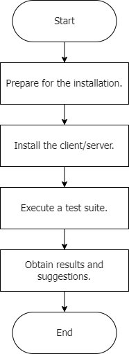
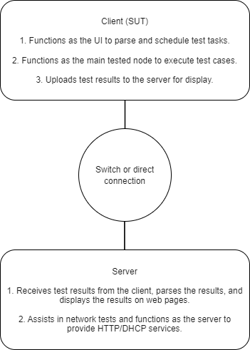

- [Overview](#overview)
  - [**Tool Introduction**](#tool-introduction)
- [Compatibility Conclusion Inheritance](#compatibility-conclusion-inheritance)
  - [Server](#server)
  - [Board](#board)
- [Version Release](#version-release)
  - [Maintenance Statement](#maintenance-statement)
- [Tool Usage](#tool-usage)
  - [Usage Process](#usage-process)
  - [Operating Environment](#operating-environment)
    - [Environment Requirements](#environment-requirements)
      - [Server Test Environment Requirements](#server-test-environment-requirements)
      - [Board Test Environment Requirements](#board-test-environment-requirements)
    - [Operating Environment Networking](#operating-environment-networking)
- [Deployment Requirements for an Offline Installation Environment](#deployment-requirements-for-an-offline-installation-environment)
- [Tool Installation](#tool-installation)
  - [Prerequisites](#prerequisites)
  - [Obtaining the Installation Package](#obtaining-the-installation-package)
  - [Installation Procedure](#installation-procedure)
    - [Client](#client)
    - [Server](#server-1)
- [How to Use](#how-to-use)
  - [Prerequisites](#prerequisites-1)
  - [Procedure](#procedure)
- [Result Acquisition](#result-acquisition)
  - [Result Viewing](#result-viewing)
  - [Result Description](#result-description)
  - [Test Result Review](#test-result-review)
- [Introduction to Tests](#introduction-to-tests)
  - [Existing Tests](#existing-tests)
    - [compatible](#compatible)
    - [virtualization](#virtualization)
- [Community Developer Participation](#community-developer-participation)
  - [Deploying the Environment](#deploying-the-environment)
  - [Adding Tests](#adding-tests)
- [FAQs](#faqs)

# Overview

## **Tool Introduction**

oec-hardware is a hardware compatibility test tool provided by the openEuler community. It verifies the compatibility between servers, cards, and openEuler. The verification covers only basic functions.

Hardware vendors can use oec-hardware to verify the compatibility between hardware products and openEuler. The community provides the hardware compatibility test process. Hardware vendors can refer to the [compatibility test process](https://www.openeuler.org/en/compatibility/hardware/) to adapt their products to openEuler.

For hardware products tested by the oec-hardware tool, openEuler will release the [compatibility list](https://www.openeuler.org/en/compatibility/) on its official website, and hardware vendors will release the compatibility information on their official websites.

# Compatibility Conclusion Inheritance

## Server

If the servers to be verified use the same motherboard and are in the same CPU generation, the compatibility conclusion can be inherited.

## Board

Generally, the board model is determined based on a quadruple.

    Quadruple information:
        vendorID: chip vendor ID.
        deviceID: chip model ID.
        svID: card vendor ID.
        ssID: card model ID.
    
    How to view the quadruple
        - View on the iBMC.
        - Run the **lspci -nvv** command in the system.

Whether the board compatibility conclusion can be inherited is determined by the following points:

1. The values of **vendorID** and **deviceID** are different.

    The compatibility conclusion cannot be inherited.

2. The values of **vendor ID** and **deviceID** are the same, but those of **svID** are different.

    The compatibility conclusion cannot be inherited because the chip models are the same but the card vendors are different.

3. The values of **vendorID**, **deviceID**, and **svID** are the same.

    Different boards made of the same chip from the same vendor can inherit the compatibility conclusion.

4. The values of **vendorID**, **deviceID**, **svID**, and **ssID** are the same.

    Boards of the same series made of the same chip from the same vendor can inherit the compatibility conclusion. The vendor can assess typical boards of the series.

Board vendors can refer to the compatibility list of the community and the boards that are being adapted. If the compatibility conclusion can be inherited, describe it in the adaptation issue. The compatibility SIG will manually review such issue and update the compatibility list accordingly after the review is passed.

# Version Release

For details about the release policy and management, see `docs/design_docs/oech_rpm_version_design.md`.

## Maintenance Statement

oec-hardware-1.1.1 is no longer updated or maintained. Obtain the latest oec-hardware for installation.

# Tool Usage

## Usage Process



## Operating Environment

### Environment Requirements

#### Server Test Environment Requirements

|   Item    |                       Requirement                    |
|-----------|---------------------------------------------|
|    Server quantity   | Two servers are required, and the service network ports can communicate with each other.   |
|    Hardware   | At least one RAID controller card and one NIC (including the hardware integrated on the mainboard) are required.   |
|    Memory   | Full configuration is recommended.   |

#### Board Test Environment Requirements

|   Item    |                       Requirement                    |
|-----------|---------------------------------------------|
|    Server model   | TaiShan 200 (Model 2280), 2288H V5, or servers of the same type (for details, see the [compatibility list](https://www.openeuler.org/en/compatibility/)). For x86_64 servers, you can use Ice Lake (preferred), Cooper Lake, or Cascade.  |
|    RAID controller card   | At least RAID 0 is required.  |
|    NIC/IB card   | Insert a board of the same type into the server and the test machine respectively, and configure IP addresses on the same network segment to ensure direct communication.  |
|    FC card   | The disk array needs to be connected, and at least two LUNs need to be created.  |

**Notice** 

   To test an external driver, install the driver and configure the test environment in advance.

   External drivers must be installed in advance for GPU, vGPU, and keycard tests. Then, use this tool to perform the tests.

### Operating Environment Networking



# Deployment Requirements for an Offline Installation Environment

1. Download the official **everything** ISO file of openEuler and mount a local repository.

   If the dependent software package cannot be found in the **everything** ISO file, manually download it from the [openEuler official repository](https://repo.openeuler.org/) and upload it to the test machine for installation.

2. Configure offline test dependencies for different tests.

   | Test | File Name | Path |
   | ---- | ----- | ----- |
   | GPU  | https://github.com/wilicc/gpu-burn | `/opt` |
   |      | https://github.com/NVIDIA/cuda-samples/archive/refs/heads/master.zip | `/opt` |
   | VGPU | NVIDIA vGPU client driver | `/root` |
   |      | Download the VM image file of the corresponding version and architecture. The following uses openEuler 22.03 LTS in x86_64 as an example: https://repo.openeuler.org/openEuler-22.03-LTS/virtual_machine_img/x86_64/openEuler-22.03-LTS-x86_64.qcow2.xz | `/opt` |

# Tool Installation

## Prerequisites

This tool can run on openEuler 20.03 LTS or later. For details about the supported OS versions, see the `oec-hardware/scripts/kernelrelease.json` file.

## Obtaining the Installation Package

Configure the **everything** and **update** repositories of the corresponding version in the [openEuler official repository](https://repo.openeuler.org/) and use DNF to obtain the software package for installation.

## Installation Procedure

### Client

1. Run `dnf` to install the oec-hardware client.

   ```
   dnf install oec-hardware
   ```

2. Run **oech**. If the command runs properly, the installation is successful.

### Server

1. Run `dnf` to install oec-hardware-server.

   ```
   dnf install oec-hardware-server
   ```

2. Starts services. This service works with the Nginx service to provide web services. By default, port 80 is used. You can change the external ports in the Nginx service configuration file. Before starting services, ensure that these ports are not occupied.

   ```
   systemctl start oech-server.service
   systemctl start nginx.service
   ```

3. Disable the firewall and SElinux.

   ```
   systemctl stop firewalld
   iptables -F
   setenforce 0
   ```

# How to Use

## Prerequisites

* The `/usr/share/oech/kernelrelease.json` file lists all supported system versions. Run `uname -a` to check whether the current system kernel version is supported by the framework.

* By default, the framework scans all NICs. Before testing NICs, filter out the NICs to be tested. The test port must be connected and in the up state. You are advised not to use the service network port to perform the NIC test.

* `/usr/share/oech/lib/config/test_config.yaml ` is the configuration file template for hardware tests. Before performing `fc`, `raid`, `disk`, `ethernet`, and `infiniband` tests, configure them based on the actual environment. For other hardware tests, you do not need to configure them. For the NIC test, if the IP address is automatically added by the tool, you need to manually delete the IP address of the server for security after the test is complete.

## Procedure
1. Start the test framework on the client. Run `oech` on the client and select a test category, which can be `compatible` or `virtualization`. Enter the category number, that is, enter `1` to select the compatibility category.
   ```   
   # oech
   Please select test category.
   No.   category
   1     compatible
   2     virtualization
   Please select test category No:1
   ```

2. Set `Compatibility Test ID`, `Product URL`, and `Compatibility Test Server`. You are advised to set `Compatibility Test ID` to the issue ID on the Gitee (note that the ID cannot contain special characters), `Product URL` to the product URL, and `Compatibility Test Server` to the domain name or IP address of the server that can be directly accessed by the client (the server is used to display test reports and perform network tests). The default Nginx port number on the server is 80. If the port number is not changed after the server is installed, set `Compatibility Test Server` to the service IP address of the server. Otherwise, set it to the IP address and port number, for example, `172.167.145.2:90`.

   ```
   The openEuler Hardware Compatibility Test Suite
   Please provide your Compatibility Test ID:
   Please provide your Product URL:
   Please provide the Compatibility Test Server (Hostname or Ipaddr):
   ```

3. The test suite selection page is displayed. On the test selection page, the framework automatically scans hardware and selects the test suite that can be tested in the current environment. You can enter `edit` to go to the test selection page.

   ```
   These tests are recommended to complete the compatibility test: 
   No. Run-Now?  status    Class         Device         driverName     driverVersion     chipModel           boardModel
   1     yes     NotRun    acpi                                                                              
   2     yes     NotRun    clock                                                                             
   3     yes     NotRun    cpufreq                                                                           
   4     yes     NotRun    disk                                                                              
   5     yes     NotRun    ethernet      enp3s0         hinic          2.3.2.17          Hi1822              SP580
   6     yes     NotRun    ethernet      enp4s0         hinic          2.3.2.17          Hi1822              SP580
   7     yes     NotRun    ethernet      enp125s0f0     hns3                             HNS GE/10GE/25GE    TM210/TM280
   8     yes     NotRun    ethernet      enp125s0f1     hns3                             HNS GE/10GE/25GE    TM210/TM280
   9     yes     NotRun    raid          0000:04:00.0   megaraid_sas   07.714.04.00-rc1  SAS3408             SR150-M
   10    yes     NotRun    gpu           0000:03:00.0   amdgpu                           Navi                Radeon PRO W6800
   11    yes     NotRun    ipmi                                                                              
   12    yes     NotRun    kabi                                                                              
   13    yes     NotRun    kdump                                                                             
   14    yes     NotRun    memory                                                                            
   15    yes     NotRun    perf                                                                              
   16    yes     NotRun    system                                                                            
   17    yes     NotRun    usb                                                                               
   18    yes     NotRun    watchdog                                                      
   Ready to begin testing? (run|edit|quit)
   ```

4. Select a test suite. The options `all` and `none` are used to select all and cancel all respectively. The mandatory test `system` cannot be canceled. After the test is executed successfully for multiple times, the status of `system` changes to `Force`. Enter a number to select a test suite. Only one number can be entered at a time. After you press **Enter**, `no` changes to `yes`, indicating that the test suite is selected.

   ```
   Select tests to run:
   No. Run-Now?  status    Class         Device         driverName     driverVersion     chipModel           boardModel
   1     no      NotRun    acpi                                                                              
   2     no      NotRun    clock                                                                             
   3     no      NotRun    cpufreq                                                                           
   4     no      NotRun    disk                                                                              
   5     yes     NotRun    ethernet      enp3s0         hinic          2.3.2.17          Hi1822              SP580
   6     no      NotRun    ethernet      enp4s0         hinic          2.3.2.17          Hi1822              SP580
   7     no      NotRun    ethernet      enp125s0f0     hns3                             HNS GE/10GE/25GE    TM210/TM280
   8     no      NotRun    ethernet      enp125s0f1     hns3                             HNS GE/10GE/25GE    TM210/TM280
   9     yes     NotRun    raid          0000:04:00.0   megaraid_sas   07.714.04.00-rc1  SAS3408             SR150-M
   10    yes     NotRun    gpu           0000:03:00.0   amdgpu                           Navi                Radeon PRO W6800
   11    yes     NotRun    ipmi                                                                              
   12    yes     NotRun    kabi                                                                              
   13    yes     NotRun    kdump                                                                             
   14    yes     NotRun    memory                                                                            
   15    yes     NotRun    perf                                                                              
   16    yes     NotRun    system                                                                            
   17    yes     NotRun    usb                                                                               
   18    yes     NotRun    watchdog     
   Selection (<number>|all|none|quit|run):
   ```

5. Start tests. After selecting a test suite, enter `run` to start tests.

6. Upload the test result. After a test is complete, you can upload the test result to the server for result display and log analysis. If the upload fails, check the network configuration and upload the test result again.

   ```
   ...
   -------------  Summary  -------------
   ethernet-enp3s0                  PASS
   system                           PASS
   Log saved to /usr/share/oech/logs/oech-20200228210118-TnvUJxFb50.tar succ.
   Do you want to submit last result? (y|n) y
   Uploading...
   Successfully uploaded result to server X.X.X.X.
   ```

# Result Acquisition

## Result Viewing

1. Open the browser, enter the server IP address, click **Results**, and find the corresponding test IDs.

   

2. View the detailed test results on each page, including the environment information and execution results.

   - **Summary**: View all test results.

   - **Devices**: View information about all hardware devices.

   - **Runtime**: View the test running time and general task execution logs.

   - **Attachment**: Download the test log attachment.

   - **Submit**: Upload the test results to the openEuler official authentication server (**not available currently**).

     


## Result Description

The **Result** column displays the test result, which can be **PASS** or **FAIL**. If the result is **FAIL**, click the result to view the execution log and rectify the fault based on the case code.

## Test Result Review

If the tested hardware and servers need to be released to the openEuler compatibility list, upload the following test results to the related adaptation issues:

   - oec-hardware test logs

   - HTML test report generated by oec-hardware-server

   - Compatibility list file

      After the test suite has been executed, oec-hardware automatically generates a compatibility information file **hw_compatibility.json** for the hardware that passes the test suite. Fill in the template in the **templates** directory and upload the template file.

      At least one RAID controller card and one NIC need to be tested for server adaptation, and corresponding information needs to be provided.

# Introduction to Tests

## Existing Tests
### compatible

1. **system**
   
   - Checks whether this tool is modified.
   - Checks whether the OS version matches the kernel version.
   - Checks whether the kernel is modified or infected.
   - Checks whether SELinux is properly enabled.
   - Uses the dmidecode tool to read hardware information.

2. **cpufreq**

   - Tests whether the CPU running frequency is the same as expected when different frequency control policies are used.
   - Tests whether the time required for the CPU to complete the same calculation workload is inversely correlated with the frequency.

3. **clock**

   - Tests the clock direction, that is, whether the clock goes backwards.
   - Tests the basic stability of the RTC (hardware clock).

4. **memory**

   - Uses the memtester tool to perform the memory read/write test.
   - Uses mmap to check all available memory, trigger memory swapping, and perform the read/write test for 120s.
   - Tests the HugeTLB.
   - Tests memory hot swap.

5. **network**

   - Uses ethtool to obtain the NIC information and uses ifconfig to perform the down/up test on the NIC.
   - Uses qperf to test the TCP/UDP latency and bandwidth, as well as HTTP upload and download rates of the Ethernet NIC.
   - Uses perftest to test the latency and bandwidth of the InfiniBand (IB) or RoCE network.

      **Notice** 
   
      Before performing a network bandwidth test, ensure that the rate of the server NIC is greater than or equal to that of the client NIC and that the test network is not interfered by other traffic.

6. **disk**

   Uses Flexible I/O Tester (FIO) to perform sequential/random read/write tests on raw disks or file systems.

7. **kdump**

   Triggers kdump to check whether vmcore files can be properly generated and parsed.

8. **watchdog**

   Triggers the watchdog to check whether the system can be reset properly.

9. **perf**

   - Collects events generated by hardware in the system.
   - Collects sampling information and displays the statistics.

10. **cdrom**

    Uses mkisofs and cdrecord to burn and read the optical disc drive.

11. **ipmi**

    Uses IPMItool to query IPMI information.

12. **nvme**

    Uses nvme-cli to format, read, write, and query drives.

13. **usb**

    Removes and inserts the USB device to test whether the USB port can be identified properly.

14. **acpi**

    Uses acpidump to read data.
    
15. **FC**

    Uses FIO to perform sequential/random read/write tests on the FC storage server.

16. **RAID**

    Uses FIO to perform sequential/random read/write tests on hard drives in a RAID array.

17. **keycard**

    Tests whether the keycard can be used normally.

18. **GPU**

    - NVIDIA GPUs

      - Uses gpu_burn to perform a stress test on the GPU.
      - Uses cuda_samples to test the basic functions of the GPU.

    - AMD GPUs

      - Uses radeontop to check the GPU usage.
      - Uses glmark2 to view the GPU screen information.
      - Uses glmark2 to perform a stress test on the GPU.

         **Notice** 
      
         The tests for AMD GPUs depend on the GUI. Before the tests, deploy and switch to the GUI.

19. **infiniband**

    - Uses ethtool to obtain NIC information.
    - Uses perftest to test the latency and bandwidth of the IB network.
    
      **Notice** 
      
      Before performing a network bandwidth test, ensure that the rate of the server NIC is greater than or equal to that of the client NIC and that the test network is not interfered by other traffic.

20. **kabi**

    - Checks whether the Kernel Application Binary Interface (kABI) changes compared with the standard system.

21. **VGPU**

    - Tests the basic functions of the NVIDIA vGPU server.
    - Deploys the NVIDIA vGPU client VM, and tests the driver installation and the vGPU functions of the client.
    - Uses the vGPU server to monitor the running of the client.
	
22. **spdk**

    - Uses spdk to perform sequential/random read/write tests on SSDs.

23. **dpdk**

    - Uses dpdk-testpmd to connect two Ethernet ports in loopback mode. If no external traffic generator is available,
    the client uses the Tx-only mode as the data packet source and the server uses the Rx-only mode
    as the data packet receiver to test the transmission rate of the ports.

24. **srpm**

    - Checks whether the source RPM (SRPM) of the current OS version meets the minimum core package selection baseline requirements (versions later than 24.03 LTS are supported).

### virtualization

    Existing virtualization test cases are to be updated.

# Community Developer Participation

## Deploying the Environment

1. Fork the oec-hardware source code repository to the personal space.

2. Clone the source code.

    ```
    git clone https://gitee.com/${gitee_id}/oec-hardware.git
    ```

3. Go to the corresponding directory and compile and install the software.

    ```
    cd oec-hardware
    make && make install
    ```
    
4. Package the software. Version 1.0.0 is used as an example. For details about the packaged version, see the spec file.

    ```
    dnf install -y rpm-build 
    cd oec-hardware
    tar jcvf oec-hardware-1.0.0.tar.bz2 *
    mkdir -p /root/rpmbuild/SOURCES
    cp oec-hardware-1.0.0.tar.bz2 /root/rpmbuild/SOURCES/
    rpmbuild -ba oec-hardware.spec
    ```

## Adding Tests

1. If the category of the new test already exists in the `tests/` directory, add the test to the category. The directory name of the test must be the same as the name of the entry function. For example, the entry file of the acpi test is **acpi.py**, and the framework `Test` is inherited to implement the test class. Otherwise, add a category directory and then add the test to the category.

2. Important member variables or functions in the test class are described as follows:

   - `test` function: main test flow. It is **mandatory**.

   - `setup` function: environment setup before the test. It is used to initialize the information about the tested device. The network test can be used as reference.

   - `teardown` function: environment cleanup after the test is complete. It ensures that the environment can be properly restored whether the test is successful or not. The network test can be used as reference.

   - `requirements` variable: an array to store the names of the dependent RPM packages of the test. The RPM packages are automatically installed by the framework before the test starts.

   - `reboot` and `rebootup` variables: If `reboot = True`, the test suite or test case will reboot the system and continue to execute the function specified by `rebootup` after the reboot. The kdump test can be used as reference.

3. Add the identification result of the test to the **hwcompatible/compatibility.py** file. For details about how to identify boards, see https://gitee.com/openeuler/oec-hardware/blob/master/docs/develop_doc/get_board_en.md.

# FAQs

Submit issues to this repository or send an email to oecompatibility@openeuler.org.
