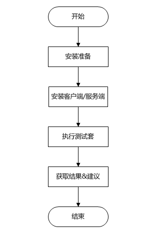
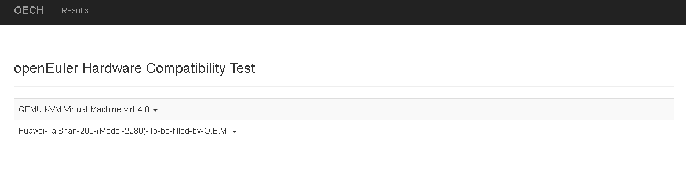
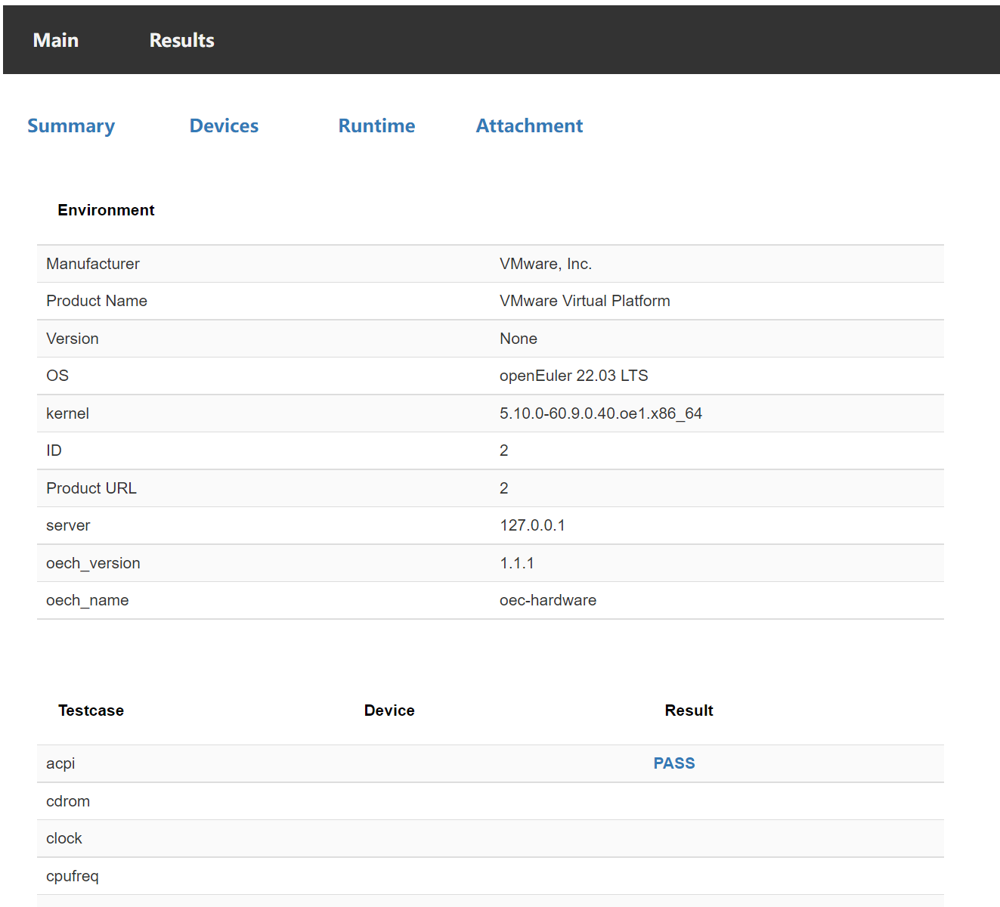

<!-- TOC -->

- [概述](#概述)
   - [工具介绍](#工具介绍)
   - [兼容性结论继承说明](#兼容性结论继承说明)
      - [整机兼容性结论继承策略](#整机兼容性结论继承策略)
      - [板卡兼容性结论继承策略](#板卡兼容性结论继承策略)
   - [版本发布](#版本发布)
      - [版本维护声明](#版本维护声明)
   - [工具使用](#工具使用)
      - [测试流程](#测试流程)
   - [使用流程](#使用流程)
      - [用户使用流程](#用户使用流程)
   - [运行环境](#运行环境)
      - [运行环境依赖组件](#运行环境依赖组件)
      - [运行环境组网](#运行环境组网)
- [工具安装](#工具安装)
   - [前提条件](#前提条件)
   - [获取安装包](#获取安装包)
   - [安装过程](#安装过程)
      - [客户端](#客户端)
      - [服务端](#服务端)
- [使用指导](#使用指导)
   - [前提条件](#前提条件-1)
   - [使用步骤](#使用步骤)
- [结果获取](#结果获取)
   - [查看结果](#查看结果)
   - [结果说明](#结果说明)
   - [测试结果审核](#测试结果审核)
- [测试项介绍](#测试项介绍)
   - [已有测试项](#已有测试项)
- [社区开发者参与介绍](#社区开发者参与介绍)
   - [环境部署](#环境部署)
   - [新增测试项](#新增测试项)
- [FAQ](#FAQ)

<!-- /TOC -->

# 概述

## 工具介绍

oec-hardware工具是openEuler社区提供的一款硬件兼容性测试工具，oec-hardware提供服务器整机、板卡与openEuler的兼容性验证测试，验证仅限于基本功能验证，不包括性能测试等其它测试。

硬件厂商在需要验证硬件产品与openEuler的兼容性时，可以使用oec-hardware。社区提供硬件兼容性测试流程，硬件厂商可以参考 [社区兼容性适配流程](https://www.openeuler.org/zh/compatibility/hardware/) 进行和openEuler的适配。

通过oec-hardware工具测试的硬件产品，openEuler会在社区官网发布 [兼容性清单](https://www.openeuler.org/zh/compatibility/) ，硬件厂商会在厂商官网发布对应的兼容性信息。

# 兼容性结论继承说明

## 整机兼容性结论继承策略

如果验证适配的服务器共主板、CPU代次相同，可以继承兼容性结论。

## 板卡兼容性结论继承策略

板卡型号一般通过四元组来进行确认。

    四元组信息：
        vendorID：芯片厂商ID
        deviceID: 芯片型号ID
        svID：板卡厂商ID
        ssID: 板卡型号ID
    
    四元组查看方式：
        - 通过iBMC查看
        - 在系统中执行命令"lspci -nvv"查看

板卡兼容性结论继承有以下三点:

1. vendorID和deviceID不同

    无法继承兼容性结论。

2. vendorID和deviceID，svID不同

    芯片型号相同但是板卡厂商不同，无法继承兼容性结论。

3. vendorID、deviceID、svID相同

    代表同一个板卡厂商，使用同一种芯片做成的不同板卡，可以继承兼容性结论。

4. vendorID、deviceID、svID、ssID相同

    代表同一个板卡厂商，使用同一种芯片做成的同一系列板卡，四元组信息相同，可以继承兼容性结论。厂商自行评估此系列板卡，可以写代表性的板卡名称。

板卡厂商参考社区的兼容性清单以及正在适配中的板卡，如果可以继承兼容性结论，需要在对应的适配issue中进行说明，兼容性sig组会进行人工审核，审核通过后会发布对应的兼容性清单。

# 版本发布

详细版本发布策略和版本发布方案请见`docs/design_docs/oech_rpm_version_design.md`

## 版本维护声明

oec-hardware-1.1.1 版本将不再进行更新维护，请获取最新版本的 oec-hardware 进行安装使用。

# 工具使用

## 使用流程

### 用户使用流程



## 运行环境

### 环境要求

#### 整机测试环境要求

|   项目    |                       要求                    |
|-----------|---------------------------------------------|
|    整机数量   | 需要两台整机，业务网口互通   |
|    硬件   | 至少有一张RAID卡和一张网卡（包括集成主板硬件)   |
|    内存   | 建议满配   |

#### 板卡测试环境要求

|   项目    |                       要求                    |
|-----------|---------------------------------------------|
|    服务器型号   | Taishan200(Model 2280)、2288H V5或同等类型的服务器（详见社区 [整机兼容性清单](https://www.openeuler.org/zh/compatibility/)），对于x86_64服务器，icelake/cooperlake/cascade可任选一种，优选icelake   |
|    RAID卡   | 需要组raid，至少组raid0   |
|    NIC/IB卡   | 服务端和测试端需要分别插入一张同类型板卡，配置同网段IP，保证直连互通  |
|    FC卡   | 需要连接磁阵，至少组两个lun   |

**注意** 

   如果要测试外部驱动，请提前安装驱动，配置测试环境。

   GPU、VGPU、keycard等测试项需要提前安装外部驱动，保证环境部署完成，然后使用本工具进行测试。

### 运行环境组网


# 离线安装环境部署要求

1. 下载 openEuler 官方的 everything iso，挂载本地 repo 源。

   如果在 everything iso 中无法找到依赖的软件包，请手动从 [openEuler 官方 repo](https://repo.openeuler.org/) 中下载软件包，上传至测试机中进行安装。

2. 根部不同的测试项，配置离线测试依赖

   | 测试项 | 文件名 | 路径 |
   | ---- | ----- | ----- |
   | GPU  | https://github.com/wilicc/gpu-burn | `/opt` |
   |      | https://github.com/NVIDIA/cuda-samples/archive/refs/heads/master.zip | `/opt` |
   | VGPU | NVIDIA vgpu client驱动软件包 | /root |
   |      | 下载对应版本和架构的虚拟机镜像文件，此处以openEuler 22.03LTS、x86_64为例：https://repo.openeuler.org/openEuler-22.03-LTS/virtual_machine_img/x86_64/openEuler-22.03-LTS-x86_64.qcow2.xz | `/opt` |

# 工具安装

## 前提条件

本工具支持在 openEuler 20.03 (LTS) 或更高版本上运行，详细支持操作系统版本信息请查看 `oec-hardware/scripts/kernelrelease.json` 文件。

## 获取安装包

配置 [openEuler 官方 repo](https://repo.openeuler.org/) 中对应版本的 everything  和 update repo源，使用 `dnf` 获取软件包进行安装。

## 安装过程

### 客户端

1. 使用 `dnf` 安装客户端 oec-hardware。

   ```
   dnf install oec-hardware
   ```

2. 输入 `oech` 命令，可正常运行，则表示安装成功。

### 服务端

1. 使用 `dnf` 安装服务端 oec-hardware-server。

   ```
   dnf install oec-hardware-server
   ```

2. 启动服务。本服务通过搭配 nginx 服务提供 web 服务，默认使用 80 端口，可以通过 nginx 服务配置文件修改对外端口，启动前请保证这些端口未被占用。

   ```
   systemctl start oech-server.service
   systemctl start nginx.service
   ```

3. 关闭防火墙和 SElinux。

   ```
   systemctl stop firewalld
   iptables -F
   setenforce 0
   ```

# 使用指导

## 前提条件

* `/usr/share/oech/kernelrelease.json` 文件中列出了当前支持的所有系统版本，使用`uname -a` 命令确认当前系统内核版本是否属于框架支持的版本。

* 框架默认会扫描所有网卡，对网卡进行测试前，请自行筛选被测网卡；要求测试端口连通，状态为up。建议不要使用业务网口进行网卡测试。

* `/usr/share/oech/lib/config/test_config.yaml ` 是硬件测试项配置文件模板，`fc`、`raid`、`disk`、`ethernet`、`infiniband`硬件测试前需先根据实际环境进行配置，其它硬件测试不需要配置。对于网卡测试，如果是工具自动添加的IP地址，测试完成后，为了安全，服务端的IP需手动删除。

## 使用步骤

1. 在客户端启动测试框架。在客户端启动 `oech`，填写`ID`、`URL`、`Server`配置项，`ID` 建议填写 gitee 上的 issue ID（注意：`ID`中不能带特殊字符）；`URL`建议填写产品链接；`Server` 必须填写为客户端可以直接访问的服务器域名或 ip，用于展示测试报告和作网络测试的服务端。服务端`nginx`默认端口号是`80`，如果服务端安装完成后没有修改该端口，`Compatibility Test Server` 的值只需要输入服务端的业务IP地址；否则需要带上端口号，比如：`172.167.145.2:90`。

   ```
   # oech
   The openEuler Hardware Compatibility Test Suite
   Please provide your Compatibility Test ID:
   Please provide your Product URL:
   Please provide the Compatibility Test Server (Hostname or Ipaddr):
   ```

2. 进入测试套选择界面。在用例选择界面，框架将自动扫描硬件并选取当前环境可供测试的测试套，输入 `edit` 可以进入测试套选择界面。

   ```
   These tests are recommended to complete the compatibility test: 
   No. Run-Now?  status    Class         Device         driverName     driverVersion     chipModel           boardModel
   1     yes     NotRun    acpi                                                                              
   2     yes     NotRun    clock                                                                             
   3     yes     NotRun    cpufreq                                                                           
   4     yes     NotRun    disk                                                                              
   5     yes     NotRun    ethernet      enp3s0         hinic          2.3.2.17          Hi1822              SP580
   6     yes     NotRun    ethernet      enp4s0         hinic          2.3.2.17          Hi1822              SP580
   7     yes     NotRun    ethernet      enp125s0f0     hns3                             HNS GE/10GE/25GE    TM210/TM280
   8     yes     NotRun    ethernet      enp125s0f1     hns3                             HNS GE/10GE/25GE    TM210/TM280
   9     yes     NotRun    ipmi                                                                              
   10    yes     NotRun    kabi                                                                              
   11    yes     NotRun    kdump                                                                             
   12    yes     NotRun    memory                                                                            
   13    yes     NotRun    perf                                                                              
   14    yes     NotRun    system                                                                            
   15    yes     NotRun    usb                                                                               
   16    yes     NotRun    watchdog                                                      
   Ready to begin testing? (run|edit|quit)
   ```

3. 选择测试套。`all|none` 分别用于 `全选|全取消`（必测项 `system` 不可取消，多次执行成功后 `system` 的状态会变为`Force`）；数字编号可选择测试套，每次只能选择一个数字，按回车符之后 `no` 变为 `yes`，表示已选择该测试套。

   ```
   Select tests to run:
   No. Run-Now?  status    Class         Device         driverName     driverVersion     chipModel           boardModel
   1     no      NotRun    acpi                                                                              
   2     no      NotRun    clock                                                                             
   3     no      NotRun    cpufreq                                                                           
   4     no      NotRun    disk                                                                              
   5     yes     NotRun    ethernet      enp3s0         hinic          2.3.2.17          Hi1822              SP580
   6     no      NotRun    ethernet      enp4s0         hinic          2.3.2.17          Hi1822              SP580
   7     no      NotRun    ethernet      enp125s0f0     hns3                             HNS GE/10GE/25GE    TM210/TM280
   8     no      NotRun    ethernet      enp125s0f1     hns3                             HNS GE/10GE/25GE    TM210/TM280
   9     no      NotRun    ipmi                                                                              
   10    no      NotRun    kabi                                                                              
   11    no      NotRun    kdump                                                                             
   12    no      NotRun    memory                                                                            
   13    no      NotRun    perf                                                                              
   14    yes     NotRun    system                                                                            
   15    no      NotRun    usb                                                                               
   16    no      NotRun    watchdog     
   Selection (<number>|all|none|quit|run):
   ```

4. 开始测试。选择完成后输入 `run` 开始测试。

5. 上传测试结果。测试完成后可以上传测试结果到服务器，便于结果展示和日志分析。如果上传失败，请检查网络配置，然后重新上传测试结果。

   ```
   ...
   -------------  Summary  -------------
   ethernet-enp3s0                  PASS
   system                           PASS
   Log saved to /usr/share/oech/logs/oech-20200228210118-TnvUJxFb50.tar succ.
   Do you want to submit last result? (y|n) y
   Uploading...
   Successfully uploaded result to server X.X.X.X.
   ```

# 结果获取

## 查看结果

1. 浏览器打开服务端 IP 地址，点击导航栏 `Results` 界面，找到对应的测试 id 进入。

   

2. 进入单个任务页可以看到具体的测试结果展示，包括环境信息和执行结果等。

   - `Summary` 查看所有测试结果。

   - `Devices` 查看所有硬件设备信息。

   - `Runtime` 查看测试运行时间和总任务执行日志。

   - `Attachment` 下载测试日志附件。

   - `Submit` 表示将结果上传到欧拉官方认证服务器（**当前尚未开放**）。

     


## 结果说明

在 **Result** 列展示测试结果，结果有两种：**PASS** 或者 **FAIL**。如果结果为**FAIL**，可以直接点击结果来查看执行日志，根据报错对照用例代码进行排查。

## 测试结果审核

如果测试的硬件、整机需要发布到openEuler的兼容性清单，请将以下测试结果全部上传至相关的适配issue下：

   - oec-hardware 测试日志

   - oec-hardware-server 生成的html测试报告

   - 兼容性清单文件

      oec-hardware 执行结束后会自动为测试通过的硬件生成兼容性信息文件`hw_compatibility.json`，请参考该文件填写templates目录下的模板，然后上传填写的模板文件。

      整机适配需要测试至少一张RAID卡、一张网卡，并提供对应的信息。

# 测试项介绍

## 已有测试项

1. **system**
   
   - 检查本工具是否被修改。
   - 检查 OS 版本和 kernel 版本是否匹配。
   - 检查内核是否被修改/感染。
   - 检查 selinux 是否正常启用。
   - 使用 dmidecode 工具读取硬件信息。

2. **cpufreq**

   - 测试 cpu 在不同调频策略下运行频率是否同预期。
   - 测试 cpu 在不同频率下完全同规格计算量所需时间是否与频率值反相关。

3. **clock**

   - 测试时间矢量性，不会倒回。
   - 测试 RTC 硬件时钟基本稳定性。

4. **memory**

   - 使用 memtester 工具进行内存读写测试。
   - mmap 全部系统可用内存，触发 swap，进行 120s 读写测试。
   - 测试 hugetlb。
   - 内存热插拔测试。

5. **network**

   - 使用 ethtool 获取网卡信息和 ifconfig 对网卡进行 down/up 测试。
   - 使用 qperf 测试以太网卡tcp/udp延迟和带宽，以及 http 上传、下载速率。
   - 使用 perftest 测试 infiniband(IB) 或 RoCE 网络协议的延迟和带宽。

      **注意** 
   
      进行网络带宽测试时，请提前确认服务端网卡速率不小于客户端，并保证测试网络无其他流量干扰。

6. **disk**

   使用 fio 工具进行裸盘/文件系统的顺序/随机读写测试。

7. **kdump**

   触发 kdump，测试能否正常生成 vmcore 文件并解析。

8. **watchdog**

   触发 watchdog，测试系统是否可以正常复位。

9. **perf**

   - 收集系统中硬件产生的事件。
   - 收集采样信息，查看统计结果。

10. **cdrom**

    使用 mkisofs 和 cdrecord 对光驱进行刻录和读取测试。

11. **ipmi**

    使用 ipmitool 查询 IPMI 信息。

12. **nvme**

    使用 nvme-cli 工具对盘进行格式化、读写、查询测试。

13. **usb**

    插拔 usb 设备，测试 usb 接口能否正常识别。

14. **acpi**

    利用 acpidump 工具读取数据。
    
15. **FC**

    使用 fio 工具进行FC存储服务器的顺序/随机读写测试。

16. **RAID**

    使用 fio 工具进行RAID下硬盘的顺序/随机读写测试。

17. **keycard**

    测试加密卡是否能正常使用。

18. **GPU**

    - NVIDIA GPU

      - 使用 gpu_burn 工具对GPU进行加压测试。
      - 使用 cuda_samples 测试GPU的基本功能。

    - AMD GPU

      - 使用 radeontop 工具查看GPU使用率。
      - 使用 glmark2 工具查看GPU screen信息。
      - 使用 glmark2 工具对GPU进行加压测试。

         **注意** 
      
         AMD GPU测试依赖图形界面，在测试前需要部署并切换到图形界面。

19. **infiniband**

    - 使用 ethtool 获取网卡信息。
    - 使用 perftest 测试 infiniband(IB) 网络协议的延迟和带宽。
    
      **注意** 
      
      进行网络带宽测试时，请提前确认服务端网卡速率不小于客户端，并保证测试网络无其他流量干扰。

20. **kabi**

    - 测试内核 kabi 和标准系统相比是否发生变化。

21. **VGPU**

    - 测试 NVIDIA VGPU 服务端基本功能。
    - 部署 NVIDIA VGPU 客户端虚拟机，测试驱动安装，测试客户端 VGPU 功能。
    - VGPU 服务端监控客户端的运行。
	
22. **spdk**

    - 使用spdk工具对固态硬盘进行顺序和随机读写测试。

22. **dpdk**

    - 使用dpdk-testpmd把两个以太网端口连成环回模式，在没有外部流量发生器的情况下，
    客户端使用发包模式(Tx-only mode)作为数据包源，服务端使用收包模式(Rx-only mode)
    作为数据包接收器, 测试端口传输速率功能。

# 社区开发者参与介绍

## 环境部署

1. 将oec-hardware源码仓库fork到个人空间；

2. 克隆仓库源码；

    ```
    git clone https://gitee.com/${gitee_id}/oec-hardware.git
    ```

3. 进入对应的目录，编译安装；

    ```
    cd oec-hardware
    make && make install
    ```
    
4. 打包验证，此处以1.0.0版本为例进行打包，具体打包的版本请以spec文件里的版本为准。

    ```
    dnf install -y rpm-build 
    cd oec-hardware
    tar jcvf oec-hardware-1.0.0.tar.bz2 *
    mkdir -p /root/rpmbuild/SOURCES
    cp oec-hardware-1.0.0.tar.bz2 /root/rpmbuild/SOURCES/
    rpmbuild -ba oec-hardware.spec
    ```

## 新增测试项

1. 在 `tests/` 目录下添加测试项模板，通过继承框架 `Test` 实现自己的测试类。

2. 测试类中的重要成员变量或函数介绍：

   - 函数 `test` - **必选**，测试主流程。

   - 函数 `setup` - 测试开始前环境准备，主要用于初始化被测设备相关信息，可以参考 network 测试。

   - 函数 `teardown` - 测试完成后环境清理，主要用于确保无论测试成功失败都能正确恢复环境，可以参考 network 测试。

   - 变量 `requirements` - 以数组形式存放测试依赖的 rpm 包名，测试开始前框架自动安装。

   - 变量 `reboot` 和 `rebootup` - 若 `reboot = True` 表示该测试套/测试用例会重启系统，且在重启后继续执行 `rebootup` 指定的函数，可以参考 kdump 测试。

3. 在 `hwcompatible/compatibility.py` 文件中添加对应测试项的识别显示。

# FAQ

 [鲲鹏小智](https://ic-openlabs.huawei.com/chat/#/) 提供了oec-hardware测试过程中可能遇到的问题的解决方案，用户可以通过检索获取问题的解决方法。另外 [鲲鹏论坛](https://bbs.huaweicloud.com/forum/forum-927-1.html)上提供了完整的[oec-hardware安装使用问题解答](https://bbs.huaweicloud.com/forum/thread-0210979171291590002-1-1.html) ，用户可以根据场景获取解决方案。
 
 如果在适配过程中遇到问题，建议用户优先通过鲲鹏小智或鲲鹏论坛获取支撑。

如果鲲鹏小智无法解决，可在本仓库下提issue反馈或者发邮件至openEuler社区兼容性SIG组邮箱：oecompatibility@openeuler.org。
