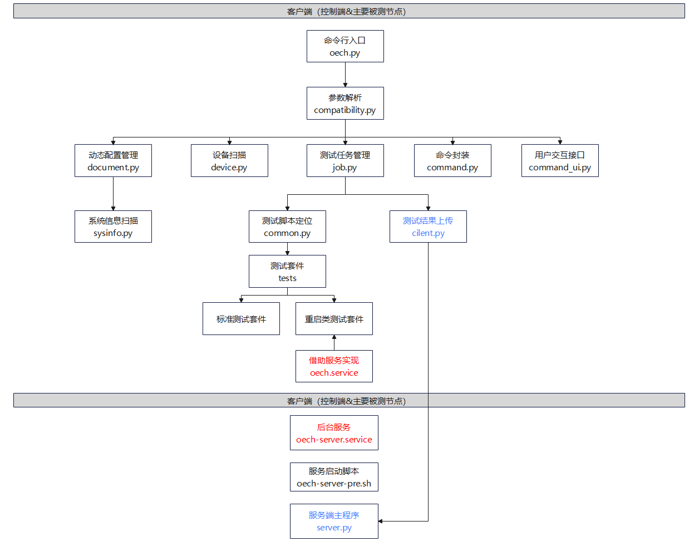

<!-- TOC -->

- [概述](#概述)
  - [工具介绍](#工具介绍)
  - [兼容性结论继承说明](#兼容性结论继承说明)
    - [整机兼容性结论继承策略](#整机兼容性结论继承策略)
    - [板卡兼容性结论继承策略](#板卡兼容性结论继承策略)
  - [版本发布](#版本发布)
    - [版本维护声明](#版本维护声明)
  - [工具使用](#工具使用)
    - [原理简介](#原理简介)
        - [框架概览](#框架概览)
        - [框架特点](#框架特点)
        - [测试流程](#测试流程)
  - [使用流程](#使用流程)
    - [用户使用流程](#用户使用流程)
  - [运行环境](#运行环境)
    - [运行环境依赖组件](#运行环境依赖组件)
    - [运行环境组网](#运行环境组网)
- [工具安装](#工具安装)
  - [前提条件](#前提条件)
  - [获取安装包](#获取安装包)
  - [安装过程](#安装过程)
    - [客户端](#客户端)
    - [服务端](#服务端)
- [使用指导](#使用指导)
  - [前提条件](#前提条件-1)
  - [使用步骤](#使用步骤)
- [结果获取](#结果获取)
  - [查看结果](#查看结果)
  - [结果说明](#结果说明)
  - [测试结果审核](#测试结果审核)
- [测试项介绍](#测试项介绍)
  - [已有测试项](#已有测试项)
- [社区开发者参与介绍](#社区开发者参与介绍)
  - [环境部署](#环境部署)
  - [新增测试项](#新增测试项)
- [FAQ](#FAQ)

<!-- /TOC -->

# 概述

## 工具介绍

oec-hardware工具是openEuler社区提供的一款硬件兼容性测试工具，oec-hardware提供服务器整机、板卡与openEuler的兼容性验证测试，验证仅限于基本功能验证，不包括性能测试等其它测试。

硬件厂商在需要验证硬件产品与openEuler的兼容性时，可以使用oec-hardware。社区提供硬件兼容性测试流程，硬件厂商可以参考 [社区兼容性适配流程](https://www.openeuler.org/zh/compatibility/hardware/) 进行和openEuler的适配。

通过oec-hardware工具测试的硬件产品，openEuler会在社区官网发布 [兼容性清单](https://www.openeuler.org/zh/compatibility/) ，硬件厂商会在厂商官网发布对应的兼容性信息。

# 兼容性结论继承说明

## 整机兼容性结论继承策略

如果验证适配的服务器共主板，可以继承兼容性结论。

## 板卡兼容性结论继承策略

板卡型号一般通过四元组来进行确认。

    四元组信息：
        vendorID：芯片厂商ID
        deviceID: 芯片型号ID
        svID：板卡厂商ID
        ssID: 板卡型号ID
    
    四元组查看方式：
        - 通过iBMC查看
        - 在系统中执行命令"lspci -nvv"查看
            

板卡兼容性结论继承有以下三点:

1. vendorID和deviceID不同

    无法继承兼容性结论。

2. vendorID和deviceID，svID不同

    芯片型号相同但是板卡厂商不同，无法继承兼容性结论。

3. vendorID、deviceID、svID相同

    代表同一个板卡厂商，使用同一种芯片做成的不同板卡，可以继承兼容性结论。

4. vendorID、deviceID、svID、ssID相同

    代表同一个板卡厂商，使用同一种芯片做成的同一系列板卡，四元组信息相同，可以继承兼容性结论。厂商自行评估此系列板卡，可以写代表性的板卡名称。

板卡厂商参考社区的兼容性清单以及正在适配中的板卡，如果可以继承兼容性结论，需要在对应的适配issue中进行说明，兼容性sig组会进行人工审核，审核通过后会发布对应的兼容性清单。

# 版本发布

详细版本发布策略和版本发布方案请见`docs/design_docs/oech_rpm_version_design.md`

## 版本维护声明

oec-hardware-1.0.0 版本将不再进行更新维护，请获取最新版本的oec-hardware进行安装使用。

# 工具使用

## 原理简介

### 框架概览

```
.
├── hwcompatible 框架主功能
│   ├── compatibility.py  框架核心功能
│   ├── client.py         上传测试结果到服务端
│   ├── command.py        bash命令执行封装
│   ├── command_ui.py      命令行交互工具
│   ├── device.py         扫描设备信息
│   ├── document.py       收集配置信息
│   ├── env.py            全局变量，主要是各个配置文件或目录的路径
│   ├── job.py            测试任务管理
│   ├── log.py            日志模块
│   ├── reboot.py         重启类任务专用，便于机器重启后仍能继续执行测试
│   ├── sysinfo.py        收集系统信息
│   └── test.py           测试套模板
├── scripts   工具脚本 
│   ├── oech                  框架客户端命令行工具
│   ├── oech-server           框架服务端命令行工具
│   ├── oech-server.service   框架服务端 service 文件，用于启动 web 服务器
│   ├── oech.service          框架客户端 service 文件，用于接管 reboot 用例
│   └── kernelrelease.json    工具支持认证的系统和内核版本
├── server   服务端
│   ├── oech-server-pre.sh    服务预执行脚本
│   ├── results/              测试结果存放目录
│   ├── server.py             服务端主程序
│   ├── static/               图片存放目录
│   ├── templates/            网页模板存放目录
│   ├── uwsgi.conf            nginx 服务配置
│   └── uwsgi.ini             uwsgi 服务配置
├── config   配置文件
│   ├── version.config        工具版本配置文件
│   └── test_config.yaml      工具测试项配置文件
├── templates                 兼容性清单模板存放目录
├── tests   测试套
└──vendor_tests               厂商测试工具存放目录
```

### 框架特点

oec-hardware工具框架有如下特点：

1. 为满足可信要求，必须使用openEuler操作系统，不能随意重编/插入内核模块。

2. 通过扫描机制自适应发现硬件列表，来确定要运行的测试用例集合。

3. 面向对象抽象各种硬件类型以及测试用例类，用于扩展开发。

### 测试流程



## 使用流程

### 用户使用流程


## 运行环境

### 运行环境依赖组件

以下是oech工具客户端的运行环境依赖组件:
| 组件      | 组件描述  | 可获得性 |
| --------- | ------ | ----------- |
| python3    | python3 及以上 | 可使用dnf进行安装 |

以下是oech工具服务端的运行环境依赖组件:

| 组件      | 组件描述  | 可获得性 |
| --------- | ------- | ----------- |
| python3   | python3 及以上 | 可使用dnf进行安装 |
| Flask    | v2.1.2 及以上版本        | 可使用pip3进行安装   |
| Flask-bootstrap    | v3.3.7.1 及以上版本        | 可使用pip3进行安装  |
| uwsgi    | v2.0.20 及以上版本        | 可使用pip3进行安装   |

### 运行环境组网


# 工具安装

## 前提条件

本工具支持在 openEuler 20.03 (LTS) 或更高版本上运行，详细支持操作系统版本信息请查看 `oec-hardware/scripts/kernelrelease.json` 文件。

## 获取安装包

配置 [openEuler 官方 repo](https://repo.openeuler.org/) 中对应版本的 everything  和 update repo源，使用 `dnf` 获取软件包进行安装。

## 安装过程

### 客户端

1. 使用 `dnf` 安装客户端 oec-hardware。

   ```
   dnf install oec-hardware
   ```

2. 输入 `oech` 命令，可正常运行，则表示安装成功。

### 服务端

1. 使用 `dnf` 安装服务端 oec-hardware-server。

   ```
   dnf install oec-hardware-server
   ```

2. 服务端 web 展示页面需要的部分组件系统本身不提供，需要使用 `pip3` 安装（请自行配置可用 pip 源）。

   ```
   pip3 install Flask Flask-bootstrap uwsgi
   ```

3. 启动服务。本服务默认使用 8080 端口，同时搭配 nginx（默认端口 80）提供 web 服务，请保证这些端口未被占用。

   ```
   systemctl start oech-server.service
   systemctl start nginx.service
   ```

4. 关闭防火墙和 SElinux。

   ```
   systemctl stop firewalld
   iptables -F
   setenforce 0
   ```

# 使用指导

## 前提条件

* `/usr/share/oech/kernelrelease.json` 文件中列出了当前支持的所有系统版本，使用`uname -a` 命令确认当前系统内核版本是否属于框架支持的版本。

* 框架默认会扫描所有网卡，对网卡进行测试前，请自行筛选被测网卡，并给它配上能 `ping` 通服务端的 ip；如果客户端是对 InfiniBand 网卡进行测试，服务端也必须有一个 InfiniBand 网卡并提前配好 ip 。建议不要使用业务网口进行网卡测试。

## 使用步骤

1. 在客户端启动测试框架。在客户端启动 `oech`，填写`ID`、`URL`、`Server`配置项，`ID` 建议填写 gitee 上的 issue ID（注意：`ID`中不能带特殊字符）；`URL`建议填写产品链接；`Server` 必须填写为客户端可以直接访问的服务器域名或 ip，用于展示测试报告和作网络测试的服务端。

   ```
   # oech
   The openEuler Hardware Compatibility Test Suite
   Please provide your Compatibility Test ID:
   Please provide your Product URL:
   Please provide the Compatibility Test Server (Hostname or Ipaddr):
   ```

2. 进入测试套选择界面。在用例选择界面，框架将自动扫描硬件并选取当前环境可供测试的测试套，输入 `edit` 可以进入测试套选择界面。

   ```
   These tests are recommended to complete the compatibility test:
   No. Run-Now?  Status  Class         Device
   1     yes     NotRun  acpi
   2     yes     NotRun  clock
   3     yes     NotRun  cpufreq
   4     yes     NotRun  disk
   5     yes     NotRun  ethernet      enp3s0
   6     yes     NotRun  ethernet      enp4s0
   7     yes     NotRun  ethernet      enp5s0
   8     yes     NotRun  kdump
   9     yes     NotRun  memory
   10    yes     NotRun  perf
   11    yes     NotRun  system
   12    yes     NotRun  usb
   13    yes     NotRun  watchdog
   Ready to begin testing? (run|edit|quit)
   ```

3. 选择测试套。`all|none` 分别用于 `全选|全取消`（必测项 `system` 不可取消，多次执行成功后 `system` 的状态会变为`Force`）；数字编号可选择测试套，每次只能选择一个数字，按回车符之后 `no` 变为 `yes`，表示已选择该测试套。

   ```
   Select tests to run:
   No. Run-Now?  Status  Class         Device
   1     no      NotRun  acpi
   2     no      NotRun  clock
   3     no      NotRun  cpufreq
   4     no      NotRun  disk
   5     yes     NotRun  ethernet      enp3s0
   6     no      NotRun  ethernet      enp4s0
   7     no      NotRun  ethernet      enp5s0
   8     no      NotRun  kdump
   9     no      NotRun  memory
   10    no      NotRun  perf
   11    yes     NotRun  system
   12    no      NotRun  usb
   13    no      NotRun  watchdog
   Selection (<number>|all|none|quit|run):
   ```

4. 开始测试。选择完成后输入 `run` 开始测试。

5. 上传测试结果。测试完成后可以上传测试结果到服务器，便于结果展示和日志分析。如果上传失败，请检查网络配置，然后重新上传测试结果。

   ```
   ...
   -------------  Summary  -------------
   ethernet-enp3s0                  PASS
   system                           PASS
   Log saved to /usr/share/oech/logs/oech-20200228210118-TnvUJxFb50.tar succ.
   Do you want to submit last result? (y|n) y
   Uploading...
   Successfully uploaded result to server X.X.X.X.
   ```

# 结果获取

## 查看结果

1. 浏览器打开服务端 IP 地址，点击导航栏 `Results` 界面，找到对应的测试 id 进入。

   

2. 进入单个任务页可以看到具体的测试结果展示，包括环境信息和执行结果等。

   - `Submit` 表示将结果上传到欧拉官方认证服务器（**当前尚未开放**）。

   - `Devices` 查看所有测试设备信息。

   - `Runtime` 查看测试运行日志。

   - `Attachment` 下载测试附件。

     


## 结果说明

在 **Result** 列展示测试结果，结果有两种：**PASS** 或者 **FAIL**。如果结果为**FAIL**，可以直接点击结果来查看执行日志，根据报错对照用例代码进行排查。

## 测试结果审核

如果测试的硬件、整机需要发布到openEuler的兼容性清单，请将以下测试结果全部上传至相关的适配issue下：

   - oech测试日志

   - oech生成的html测试报告

   - 兼容性清单文件（请参考templates目录下的模板)

        整机适配需要测试至少一张RAID卡、一张网卡，并提供对应的信息。

# 测试项介绍

## 已有测试项

1. **system**
    
   - 检查本工具是否被修改。
   - 检查 OS 版本和 kernel 版本是否匹配。
   - 检查内核是否被修改/感染。
   - 检查 selinux 是否正常启用。
   - 使用 dmidecode 工具读取硬件信息。

2. **cpufreq**

   - 测试 cpu 在不同调频策略下运行频率是否同预期。
   - 测试 cpu 在不同频率下完全同规格计算量所需时间是否与频率值反相关。

3. **clock**

   - 测试时间矢量性，不会倒回。
   - 测试 RTC 硬件时钟基本稳定性。

4. **memory**

   - 使用 memtester 工具进行内存读写测试。
   - mmap 全部系统可用内存，触发 swap，进行 120s 读写测试。
   - 测试 hugetlb。
   - 内存热插拔测试。

5. **network**

   - 使用 ethtool 获取网卡信息和 ifconfig 对网卡进行 down/up 测试。
   - 使用 qperf 测试以太网卡tcp/udp延迟和带宽，以及 http 上传、下载速率。
   - 使用 perftest 测试 infiniband(IB) 或 RoCE 网络协议的延迟和带宽。
   - **注意** 进行网络带宽测试时，请提前确认服务端网卡速率不小于客户端，并保证测试网络无其他流量干扰。

6. **disk**

   使用 fio 工具进行裸盘/文件系统的顺序/随机读写测试。

7. **kdump**

   触发 kdump，测试能否正常生成 vmcore 文件并解析。

8. **watchdog**

   触发 watchdog，测试系统是否可以正常复位。

9. **perf**

   测试 perf 工具是否能正常使用。

10. **cdrom**

    使用 mkisofs 和 cdrecord 对光驱进行刻录和读取测试。

11. **ipmi**

    使用 ipmitool 查询 IPMI 信息。

12. **nvme**

    使用 nvme-cli 工具对盘进行格式化、读写、查询测试。

13. **usb**

    插拔 usb 设备，测试 usb 接口能否正常识别。

14. **acpi**

    利用 acpidump 工具读取数据。
    
15. **FC**

    使用 fio 工具进行FC存储服务器的顺序/随机读写测试。

16. **RAID**

    使用 fio 工具进行RAID下硬盘的顺序/随机读写测试。

17. **keycard**

    测试加密卡是否能正常使用。

18. **GPU**

    - 使用gpu_burn工具对GPU进行加压测试。
    - 使用cuda_samples测试GPU是否能正常使用。

19. **infiniband**

    - 使用 ethtool 获取网卡信息。
    - 使用 perftest 测试 infiniband(IB) 网络协议的延迟和带宽。
    - **注意** 进行网络带宽测试时，请提前确认服务端网卡速率不小于客户端，并保证测试网络无其他流量干扰。

# 社区开发者参与介绍

## 环境部署
1. 将oec-hardware源码仓库fork到个人空间；

2. 克隆仓库源码；

    ```
    git clone https://gitee.com/${gitee_id}/oec-hardware.git
    ```

3. 进入对应的目录，编译安装；

    ```
    cd oec-hardware
    make && make install
    ```
    
4. 如果要进行打包验证，请安装4.17版本以上的rpm-build软件包，此处以1.0.0版本为例进行打包，具体打包的版本请以spec文件里的版本为准。

    ```
    dnf install -y rpm-build 
    cd oec-hardware
    tar oec-hardware-1.0.0.tar.bz2 *
    mkdir -p /root/rpmbuild/SOURCES
    cp oec-hardware-1.0.0.tar.bz2 /root/rpmbuild/SOURCES/
    rpmbuild -ba oec-hardware.spec
    ```

## 新增测试项

1. 在 `tests/` 目录下添加测试项模板，通过继承框架 `Test` 实现自己的测试类。

2. 测试类中的重要成员变量或函数介绍：

   - 函数 `test` - **必选**，测试主流程。

   - 函数 `setup` - 测试开始前环境准备，主要用于初始化被测设备相关信息，可以参考 network 测试。

   - 函数 `teardown` - 测试完成后环境清理，主要用于确保无论测试成功失败都能正确恢复环境，可以参考 network 测试。

   - 变量 `requirements` - 以数组形式存放测试依赖的 rpm 包名，测试开始前框架自动安装。

   - 变量 `reboot` 和 `rebootup` - 若 `reboot = True` 表示该测试套/测试用例会重启系统，且在重启后继续执行 `rebootup` 指定的函数，可以参考 kdump 测试。

3. 在 `hwcompatible/compatibility.py` 文件中添加对应测试项的识别显示。

# FAQ

 [鲲鹏小智](https://ic-openlabs.huawei.com/chat/#/)提供了oec-hardware测试过程中可能遇到的问题的解决方案，如果在适配过程中遇到问题，可以优先通过鲲鹏小智获取支撑。

如果鲲鹏小智无法解决，可在本仓库下提issue反馈或者发邮件至openEuler社区兼容性SIG组邮箱：oecompatibility@openeuler.org。