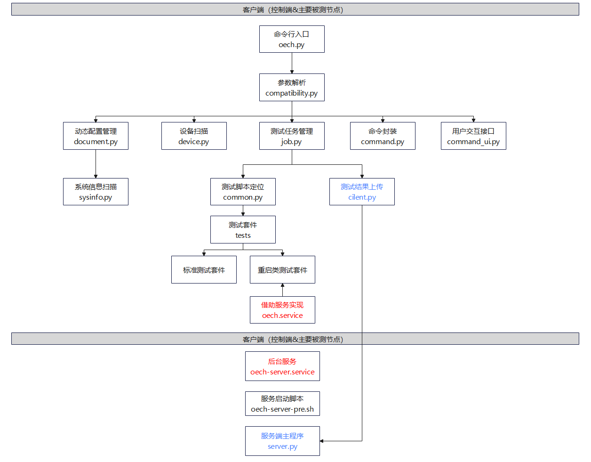

# oec-hardware 开发设计文档

## 1 需求描述

提供硬件兼容性测试工具套件以及CPU、IPMI等系统重要功能测试，实现服务器整机、板卡与openEuler的兼容性验证测试。

### 1.2 依赖组件

#### 1.2.1 客户端依赖组件 

| 组件      | 组件描述  | 可获得性 |
| --------- | ------ | --------- |
| python3    | python3 及以上版本 | 可使用 `dnf/yum` 进行安装 |
| python3-pyyaml | 读取yaml格式的配置文件 | 可使用 `dnf/yum` 进行安装 |
| python3-concurrent-log-handler | logging日志辅助模块，用于日志转储 | 可使用 `dnf/yum` 进行安装 |
| kernel | kernel代码，需要使用系统默认安装完成后的提供kernel | 系统安装完成后默认提供 |
| kernel-devel | 需要和系统默认安装使用的kernel版本保持一致 | 可使用 `dnf/yum` 进行安装 |
| kernel-headers | 需要和系统默认安装使用的kernel版本保持一致 | 可使用 `dnf/yum` 进行安装 |
| dmidecode | 获取服务器硬件信息 | 可使用 `dnf/yum` 进行安装 |
| tar | 打包测试日志 | 可使用 `dnf/yum` 进行安装 |

#### 1.2.2 服务端依赖组件 

| 组件      | 组件描述  | 可获得性 |
| --------- | ------- | -------- |
| python3 | python3 及以上版本 | 可使用 `dnf/yum` 进行安装 |
| python3-devel | python3开发模块 | 可使用 `dnf/yum` 进行安装 |
| nginx | 提供web服务器 | 可使用 `dnf/yum` 进行安装 |
| tar |  打包、解压测试日志 | 可使用 `dnf/yum` 进行安装 |
| qperf | 用于服务端网络自测 | 可使用 `dnf/yum` 进行安装 |
| psmisc | 提供进程管理服务 | 可使用 `dnf/yum` 进行安装 |
| python3-flask | 提供web访问的http协议的框架 | 可使用 `dnf/yum` 进行安装   |
| python3-uWSGI | 提供wsgi协议的服务器 | 可使用 `dnf/yum` 进行安装   |

#### 1.2.3 客户端测试项依赖组件 

| 测试项    | 组件    | 组件描述  |
| --------- | ------ | --------- | 
| acpi | acpica-tools | acpi 测试 |
| cdrom | dvd+rw-tools | cd/dvd 测试 |
| | cdrkit | |
| | genisoimage | |
| | util-linux | |
| disk/fc/raid | fio | 硬盘读写测试 |
| ethernet/infiniband | ethtool | 网卡/IB卡测试 |
| | iproute | |
| | psmisc | |
| | qperf |  |
| | perftest | |
| | opensm | |
| | rdma-core | |
| ipmi | OpenIPMI | ipmi 测试 |
| | ipmitool | |
|  kabi | gzip | kabi 测试 |
| | rpm-build | |
|  kdump | crash | kdump 测试 |
| | kernel-debuginfo | |
| | kexec-tools | |
| memory | memtester | 内存测试 |
| | libhugetlbfs-utils | |
| nvme | nvme-cli | nvme 测试 |
| perf | perf | perf测试 |
| usb | usbutils | usb 测试 |
| gpu (Nvidia) | git | Nvidia GPU测试依赖 |
| | gcc-c++ |  |
| | make | |
| gpu (AMD) | 图形桌面 | AMD GPU需要在图形界面测试，桌面类型无限制，需要用户提前安装配置 |
| | git | AMD GPU测试依赖 |
| | gcc-c++ |  |
| | make | |
| | libdrm-devel | |
| | ncurses-devel | |
| | ncurses-libs | |
| | libpciaccess-devel | |
| | libxcb-devel | |
| | meson | |
| | libX11-devel | |
| | libpng-devel | |
| | cmake | |
| | pkgconf | |
| | libjpeg | |
| | libjpeg-turbo-devel | |
| | libdrm-devel | |
| | mesa-libgbm-devel | |
| | libgudev-devel | |
| vgpu | qemu | vgpu 测试 |
| | libvirt | |
| | xz | |
| | util-linux | |
| | expect | |
| system | policycoreutils | system 测试 |
| spdk | spdk | spdk 测试 |
| dpdk | dpdk-testpmd | dpdk 测试 |

### 1.3 License

Mulan V2

## 2 设计概述

### 2.1 设计原则

- 数据与代码分离： 需要进行配置的测试项参数，通过配置文件进行管理。

- 接口与实现分离：外部依赖模块接口而不是依赖模块实现。

- 模块划分： 模块之间互相独立，执行互相不影响。

## 3 需求分析

### 3.1 框架概览

```
.
├── hwcompatible 框架主功能
│   ├── compatibility.py  框架核心功能
│   ├── client.py         上传测试结果到服务端
│   ├── command.py        bash命令执行封装
│   ├── command_ui.py     命令行交互工具
│   ├── device.py         扫描设备信息
│   ├── document.py       收集配置信息
│   ├── env.py            全局变量，主要是各个配置文件或目录的路径
│   ├── job.py            测试任务管理
│   ├── log.py            日志模块
│   ├── reboot.py         重启类任务专用，便于机器重启后仍能继续执行测试
│   ├── sysinfo.py        收集系统信息
│   ├── config_ip.py      自动检测并配置网卡IP
│   └── test.py           测试套模板
├── scripts  工具脚本 
│   ├── oech                  工具客户端命令行工具
│   ├── oech-server           工具服务端命令行工具
│   ├── oech-server.service   工具服务端 service 文件，用于启动 web 服务器
│   ├── oech.service          工具客户端 service 文件，用于接管 reboot 用例和日志转储
│   ├── oech_logrotate.sh     工具客户端日志转储脚本
│   └── kernelrelease.json    工具支持认证的系统和内核版本
├── server   服务端
│   ├── oech-server-pre.sh    服务预执行脚本
│   ├── results/              测试结果存放目录
│   ├── server.py             服务端主程序
│   ├── static/               网页图片、样式设计文件存放目录
│   ├── templates/            网页模板存放目录
│   ├── uwsgi.conf            nginx 服务配置
│   └── uwsgi.ini             uwsgi 服务配置
├── config   配置文件
│   ├── version.config        工具版本配置文件
│   └── test_config.yaml      工具测试项配置文件
├── templates                 兼容性清单模板存放目录
├── tests    测试套
└──vendor_tests               厂商测试工具存放目录
```

### 3.2 框架特点

oec-hardware工具框架有如下特点：

1. 为满足可信要求，必须使用openEuler操作系统，不能随意重编/插入内核模块；

2. 通过扫描机制自适应发现硬件列表，来确定要运行的测试用例集合；

3. 面向对象抽象各种硬件类型以及测试用例类，用于扩展开发。

### 3.3 运行流程



### 3.4 外部接口清单

#### 3.4.1 命令行接口清单

##### 3.4.1.1 工具执行

`oech`

- 命令描述：

    工具执行入口，用于初始化数据并提供测试项给用户进行选择执行。
  
##### 3.4.1.2 重启执行

`oech --rebootup`
  
- 命令描述：

    主要提供给 oech 服务使用，在执行部分需要重启的测试项时，在系统重启完成后服务会自动启动并执行该命令，继续执行指定重启的测试项。

##### 3.4.1.3 格式化数据

`oech --clean`

- 命令描述：

    清除配置信息和测试执行信息，如果系统的硬件配置发生变化，可通过该命令清除旧的配置信息，然后执行 `oech` 命令使工具重新收集硬件配置信息。

##### 3.4.1.4 查询版本号

`oech --version`

`oech-server --version`

- 命令描述：

    oech 客户端、服务端版本号查询。

#### 3.4.2 服务启动和停止

* 客户端

    启动 oech 服务：`systemctl start oech.service`

    查看 oech 状态：`systemctl status oech.service`

    停止 oech 服务：`systemctl stop oech.service`

    重启 oech 服务：`systemctl restart oech.service`

* 服务端

    启动 oech-server 服务：`systemctl start oech-server.service`

    查看 oech-server 状态：`systemctl status oech-server.service`

    停止 oech-server 服务：`systemctl stop oech-server.service`

    重启 oech-server 服务：`systemctl restart oech-server.service`

#### 3.4.3 配置文件

##### 3.4.3.1 版本配置文件

本工具通过 `version.config` 配置文件管理工具版本。

##### 3.4.3.2 硬件信息配置文件

OS 通过 `/usr/share/hwdata/pci.ids` 文件获取环境中所有的硬件信息，OS 中该文件信息显示不全，本工具提供新的 `pci.ids` 文件，补充部分硬件设备信息，后续该文件会推动合入到 `hwdata` 软件包。

##### 3.4.3.3 测试项配置文件

部分硬件测试项的测试信息通过 `test_config.yaml` 配置文件获取。

```test_config.yaml
# FC卡测试项配置信息，指定测试的端口设备号和测试的存储设备硬盘名称
# device为设备号，可通过oech或lspci查看
# disk指定为all表示测试所有硬盘，可以指定单独的硬盘或硬盘分区
fc: 
  fc1:
    device: '0000:03:00.0'
    disk: all
  fc2:
    device: '0000:03:00.1' 
    disk: sda
# RAID卡测试项配置信息，指定测试的硬件设备号和测试的RAID卡下硬盘名称
raid:
  raid1:
    device: '0000:02:00.0'
    disk: all
  raid2:
    device: '0000:0a:00.1'
    disk: sdb
# DISK卡测试项配置信息，指定测试的硬盘名称
disk: all
# 网卡测试项配置信息，指定测试的端口设备号、测试RDMA、服务端IP
# device为网卡端口设备号，可通过oech或ip a查看
# if_rdma表示是否测试网卡RDMA，默认是N，表示不测试RDMA
# client_ip为客户端测试网卡配置的IP
# server_ip为服务端测试网卡配置的IP
# 服务端的端口默认是80，如果有修改，需要添加上修改后的端口号，如下面的eth2示例。
# 服务端自动配置的IP，测试完成后，需用户手动删除(ip addr del ip地址 dev 接口)。
ethernet:
  # 已手动配置客户端和服务端测试网卡的IP，这里需要添加上服务端的IP地址。
  eth1:
    device: enp125s0f0
    if_rdma: N
    client_ip:
    server_ip: 2.2.2.4
  # 未手动配置IP，使用这里提供的IP进行客户端和服务端配置。
  eth2:
    device: enp125s0f1
    if_rdma: N
    client_ip: 2.2.2.3
    server_ip: 2.2.2.4:8090
  # 前面两种情况都没有满足，且客户端和服务端的IP地址未提供，程序会自动生成IP，进行配置。
  eth3:
    device: enp125s0f2
    if_rdma: y
    client_ip:
    server_ip:
# IB卡测试项配置信息，指定测试的端口设备号、服务端IP。
# IB卡IP的配置原则同普通网卡。
infiniband:
  ib1:
    device: ibp1s0
    client_ip:
    server_ip: 2.2.2.4
  ib2:
    device: ibp1s1
    client_ip: 2.2.2.3
    server_ip: 2.2.2.4:8090
  ib3
    device: ibp1s0
    client_ip:
    server_ip: 
  ```

### 3.5 内部模块间接口清单

| 序号 | 接口名称 | 所属模块 | 接口描述 |
| --------- | --------- | ------- | -------- |
| 1 | `EulerCertification()` | 执行模块 | 和外部接口交互，提供执行 |
| 2 | `Job()` | 任务管理模块 | 管理执行的测试任务 |
| 3 | `Device()` | 硬件信息模块 | 获取硬件的属性 |
| 4 | `CertDevice()` | 硬件信息模块 | 获取环境上所有硬件信息 |
| 5 | `Client()` | 客户端模块 | 和服务端交互 |
| 6 | `Command()` | 命令执行模块 |  安全执行shell命令  |
| 7 | `Logger()` | 日志模块 | 记录日志信息 |
| 8 | `Reboot()` | 测试项模块 | 重启测试项执行模块 |
| 9 | `Test()` | 测试项模块 | 所有测试项的父类 |
| 10 | `CommandUI()`| 命令行交互模块 | 命令行交互显示，提供用户参数输入 |
| 11 | `Document()` | 文档模块 | 文档信息获取，所有文档模块的父类 |
| 12 | `CertDocument()` | 文档模块 | 服务端信息读取 |
| 13 | `DeviceDocument()` | 文档模块 | 硬件信息读取 |
| 14 | `FactoryDocument()` | 文档模块 | 框架信息读取 |
| 15 | `ConfigFile()` | 文档模块 | 配置信息读取 |
| 16 | `CertEnv()` | 工具环境信息模块 | 提供工具文件环境路径 |
| 17 | `SysInfo()` | 系统信息模块 | 系统信息获取 |
| 18 | `ConfigIP()` | 网卡IP配置模块 | 查询并配置网卡IP |
| 19 | `CertInfo()` | 兼容性信息收集模块 | 自动收集并生成兼容性信息文件 |

### 3.6 web服务接口清单

| 序号 | 接口名称 | 类型 | 说明 |
| --------- | ------- | -------- | -------- |
| 1 | `/results` |  | web服务端测试结果 |
| 2 | `/results/<host>/<oec_id>/<job>` |  | 测试报告 |
| 3 | `/results/<host>/<oec_id>/<job>/devices/<interface>` |  | 查看指定硬件信息 |
| 4 | `/results/<host>/<oec_id>/<job>/devices` |  | 查看所有硬件信息 |
| 5 | `/results/<host>/<oec_id>/<job>/attachment` |  | 下载测试日志压缩包 |
| 6 | `/results/<host>/<oec_id>/<job>/logs/<name>` |  | 查看指定测试项的测试日志 |
| 7 | `/results/<host>/<oec_id>/<job>/submit` |  | 上传测试结果 |
| 8 | `/api/job/upload` | GET/POST  | 客户端job信息上传 |
| 9 | `/files` |  | 获取文件信息，辅助客户端网卡测试 |
| 10 | `/files/<path:path>` |  | 文件下载，辅助客户端网卡测试 |
| 11 | `/api/file/upload` | GET/POST | 文件上传，辅助客户端网卡测试 |
| 12 | `/api/<act>` | GET/POST | 文件读写，辅助客户端网卡测试 |
| 13 | `/api/config/ip`| GET/POST | 配置服务端网卡IP |

### 3.7 日志查看和转储

#### 3.7.1 客户端

##### 3.7.1.1 日志查看

oech 服务提供两种日志，操作日志和业务日志。

1. 操作日志

        路径：/var/oech/oech.log 

        功能：记录用户操作的信息；

        权限：路径权限755，日志文件权限644，普通用户可以查看；

2. 业务日志

        路径：/usr/share/oech/logs/

        功能：即测试日志，主要记录执行的测试结果，并提供问题定位信息；

        权限：路径权限755，日志文件权限644，普通用户可以查看；

##### 3.7.1.2 日志转储

1. 操作日志转储：

- 转储机制

    使用 python logging 模块的转储机制，按照日志大小、日志数量进行备份。

- 转储过程

    运行程序写入日志时，如果日志文件大小超过配置的最大日志字节 `MAX_BYTES`（默认设置为30M），日志文件会自动进行压缩转储，压缩文件名称为oech.log.1.gz，1为压缩转储序号。

    如果转储的日志数量大于配置的备份数量 `MAX_COUNT`（默认设置为30），备份日志会按照备份时间删除，最早的备注日志会被删除掉，然后对当前日志进行压缩备份。


2. 业务日志转储：

- 转储机制

    使用shell脚本进行转储，每天转储一次。

    > 脚本路径：/usr/share/oech/scripts/oech_logrotate.sh

- 转储过程

    oech 服务启动时转储脚本后台运行，每天进行转储压缩，压缩文件名称为oech-logrotate-yymmddhh.zip。
    
    如果业务日志目录下的文件数量大于配置的备份数量 `MAX_COUNT`（默认设置为30），会按照时间顺序删除日志目录下最早的文件。

    oech 服务停止后转储脚本停止，不再进行转储，再次启动时，转储脚本重新执行。

#### 3.7.2 服务端

  oech-server 服务端的日志由 `nginx` 提供，记录服务端的所有操作信息和访问的用户ip信息。另外 `nginx` 默认提供日志转储功能。

    路径：/var/log/nginx/access.log 

    功能：记录服务端的操作信息，包括用户ip、访问时间、操作方式、访问url、访问结果等信息。

    权限：路径权限770，日志文件权限664，所有用户均可查看。
