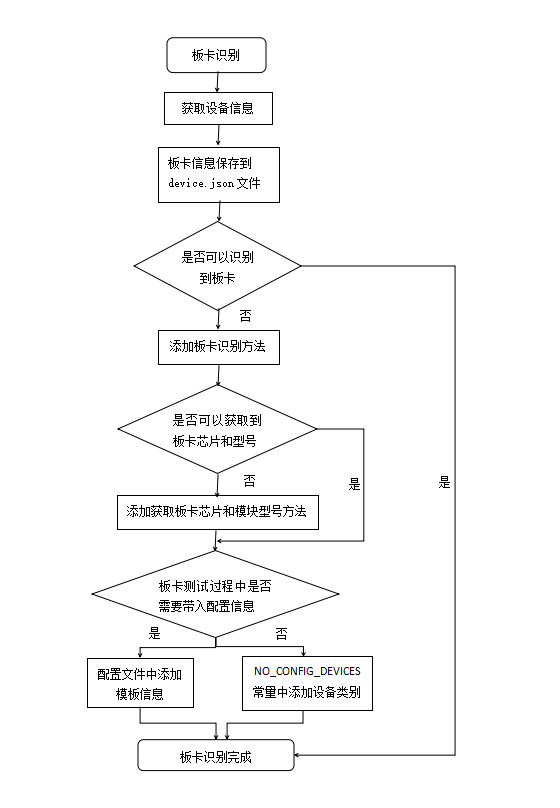

# `oec-hardware` 工具板卡识别
## 功能介绍

`oec-hardware`是先识别出要测试的板卡，显示到测试界面，再手动选择板卡开始测试。对于一张新的板卡，`oec-hardware`会有两种识别结果，一种是可以直接识别出来；另一种是识别不出来，这种情况需要在`oec-hardware`工具中添加板卡识别方法。

## 实现原理

`oec-hardware`工具通过`udevadm info --export-db`命令查询环境上设备信息，根据设备信息来识别板卡。

## 实现流程

## 识别原则

识别方法要具有普遍性，下面识别方法优先级从高到低。

- 可识别一类板卡，如通过`RAID`、`Fibre Channel`、`disk`、`gpu`卡类型字段可识别到该类型的所有卡。
- 可识别一类板卡的大部分，如通过驱动可识别出该类型的大部分卡。
- 不能满足以上两种的一种，需要板卡厂商添加板卡类型字段。

## 方法清单

| 序号 | 方法名称 | 所属模块 |方法描述 |
| --------- | --------- | ------- | -------- |
| 1 | `get_devices()`  | `device` |获取设备信息 |
| 2 | `save()`  | `document` |保存设备信息到`device.json`文件 |
| 3 | `sort_tests()`  | `compatibility` |识别设备信息 |
| 4 | `get_model()`  | `device` |获取设备芯片和模块型号 |
| 5 | `NO_CONFIG_DEVICES`  | `constants` | 不需要配置信息的板卡 |

板卡配置信息

| 序号 | 文件名称 | 文件描述|
| --------- | -------- | --------------- |
| 1 |`test_config.yaml`|板卡配置信息模板文件 |

