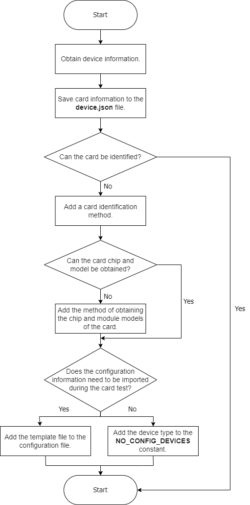

# Card Identification on oec-hardware
## Feature Description

oec-hardware identifies the card to be tested and displays the card on the test page. You need to manually select the card to start the test. For a new card, oec-hardware has two identification results. One is that the card can be directly identified, and the other is that the card cannot be identified. If the card cannot be identified, you need to add the card identification method to oec-hardware.

## Working Principle

oec-hardware uses the `udevadm info --export-db` command to query device information and identify cards based on the device information.

## Workflow

## Identification Principles

The identification methods must be universal. The priorities of the following identification methods are in descending order.

- Identify a type of cards. For example, identify all cards of this type based on the `RAID`, `Fibre Channel`, `disk`, and `gpu` fields.
- Identify most of the cards of a type. For example, identify most of the cards of this type through the driver.
- If neither of the preceding methods is applicable, the card vendor needs to add the card type field.

## Method List

| No. | Method | Module |Description |
| --------- | --------- | ------- | -------- |
| 1 | `get_devices()`  | `device` |Obtains device information. |
| 2 | `save()`  | `document` |Saves device information to the **device.json** file. |
| 3 | `sort_tests()`  | `compatibility` |Identifies device information. |
| 4 | `get_model()`  | `device` |Obtains device chip and module models.|
| 5 | `NO_CONFIG_DEVICES`  | `constants` | Specifies cards that do not require configuration information.|

Card Configuration Information

| No. | File | Description|
| --------- | -------- | --------------- |
| 1 |`test_config.yaml`|Template file of card configuration information.|
