* [前言](#前言)
* [测试指导](#测试指导)
   * [整机测试项](#整机测试项)
	    * [disk](#disk)
        * [memory](#memory)
        * [kabiwhitelist](#kabiwhitelist)
   * [板卡测试项](#板卡测试项)
        * [RAID](#RAID)
        * [NIC/IB](#NIC/IB)
        * [NVME](#NVME)
        * [GPU](#GPU)
        * [DPDK](#DPDK)
	    * [FC](#FC)


# 前言
在使用本指导前请确保已阅读 [oec-hardware工具说明](https://gitee.com/openeuler/oec-hardware/blob/master/README.md)。

# 测试指导

## 启动工具
1. 在客户端启动测试框架。输入 `oech`启动工具，输入1 选择`compatible`测试类别，首次进入oech工具需要设置ID、URL、Server配置项。
   ```   
   # oech
   Please select test category.
   No.   category
   1     compatible
   2     virtualization
   Please select test category No:1
   ```
2. 进入测试套选择界面。在用例选择界面，框架将自动扫描硬件并选取当前环境可供测试的测试套，输入 `edit` 可以进入测试套选择界面。

   ```
   These tests are recommended to complete the compatibility test: 
   No. Run-Now?  status    Class         Device         driverName     driverVersion     chipModel           boardModel
   1     yes     NotRun    acpi                                                                              
   2     yes     NotRun    clock                                                                             
   3     yes     NotRun    cpufreq                                                                           
   4     yes     NotRun    disk                                                                              
   5     yes     NotRun    ethernet      enp3s0         hinic          2.3.2.17          Hi1822              SP580
   6     yes     NotRun    ethernet      enp4s0         hinic          2.3.2.17          Hi1822              SP580
   7     yes     NotRun    ethernet      enp125s0f0     hns3                             HNS GE/10GE/25GE    TM210/TM280
   8     yes     NotRun    ethernet      enp125s0f1     hns3                             HNS GE/10GE/25GE    TM210/TM280
   9     yes     NotRun    raid          0000:04:00.0   megaraid_sas   07.714.04.00-rc1  SAS3408             SR150-M
   10    yes     NotRun    gpu           0000:03:00.0   amdgpu                           Navi                Radeon PRO W6800
   11    yes     NotRun    ipmi                                                                              
   12    yes     NotRun    kabi                                                                              
   13    yes     NotRun    kdump                                                                             
   14    yes     NotRun    memory                                                                            
   15    yes     NotRun    perf                                                                              
   16    yes     NotRun    system                                                                            
   17    yes     NotRun    usb                                                                               
   18    yes     NotRun    watchdog                                                      
   Ready to begin testing? (run|edit|quit)
   ```

3. 选择测试套。`all|none` 分别用于 `全选|全取消`（必测项 `system` 不可取消，多次执行成功后 `system` 的状态会变为`Force`）；数字编号可选择测试套，建议每次选择一个数字，按回车符之后 `no` 变为 `yes`，表示已选择该测试套。

   ```
   Select tests to run:
   No. Run-Now?  status    Class         Device         driverName     driverVersion     chipModel           boardModel
   1     no      NotRun    acpi                                                                              
   2     no      NotRun    clock                                                                             
   3     no      NotRun    cpufreq                                                                           
   4     no      NotRun    disk                                                                              
   5     yes     NotRun    ethernet      enp3s0         hinic          2.3.2.17          Hi1822              SP580
   6     no      NotRun    ethernet      enp4s0         hinic          2.3.2.17          Hi1822              SP580
   7     no      NotRun    ethernet      enp125s0f0     hns3                             HNS GE/10GE/25GE    TM210/TM280
   8     no      NotRun    ethernet      enp125s0f1     hns3                             HNS GE/10GE/25GE    TM210/TM280
   9     yes     NotRun    raid          0000:04:00.0   megaraid_sas   07.714.04.00-rc1  SAS3408             SR150-M
   10    yes     NotRun    gpu           0000:03:00.0   amdgpu                           Navi                Radeon PRO W6800
   11    yes     NotRun    ipmi                                                                              
   12    yes     NotRun    kabi                                                                              
   13    yes     NotRun    kdump                                                                             
   14    yes     NotRun    memory                                                                            
   15    yes     NotRun    perf                                                                              
   16    yes     NotRun    system                                                                            
   17    yes     NotRun    usb                                                                               
   18    yes     NotRun    watchdog     
   Selection (<number>|all|none|quit|run):
   ```
4. 开始测试。选择完成后输入"run"进行测试。

## 测试前准备

oech工具部分测试项会安装相关依赖包，请尽量保持网络连通repo源。如特殊原因无法连通，则需要手动下载安装相关依赖包。

## 整机测试项

大部分整机测试项直接选择进行测试即可，这里介绍部分需要注意的整机测试项，测试中常见问题可以参考[oec-hardware 工具使用解答](https://forum.openeuler.org/t/topic/629)。

### disk

1. `lsblk`查看磁盘状态。
2. 编辑`/usr/share/oech/lib/config/test_config.yaml`文件，设置要测试的disk范围（建议选择一个空闲未挂载的盘进行测试）。
3. 配置完成后，选择disk测试项进行测试。

### memory

memory测试项中 eat memory 测试容易因为 swap 空间不够导致机器意外重启， 建议将 swap 空间调至10G以上，并根据环境实际内存适当增加。

### kabiwhitelist

如需测试 kabiwhitelist，请在 `usr/share/oech/lib/config/test_config.yaml` 文件中编辑白名单信息。
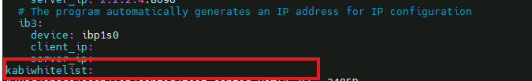


## 板卡测试项

### RAID

1. 测试前请确保硬件已被工具识别，并且添加到测试项中。
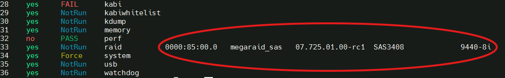

2. 编辑`/usr/share/oech/lib/config/test_config.yaml`文件，更改raid卡pci地址以及要测试的disk范围（建议选择一个空闲未挂载的盘进行测试）。
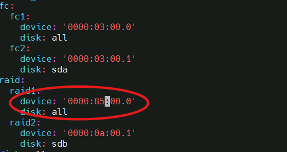

3. 配置完成后，选择raid测试项进行测试。

### NIC/IB 

1. 网卡测试需要额外一台服务器作为服务端，并且需要客户端与服务端安装了相同的待测网卡并确保网卡直连。
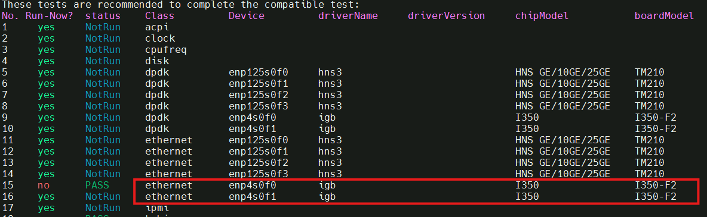
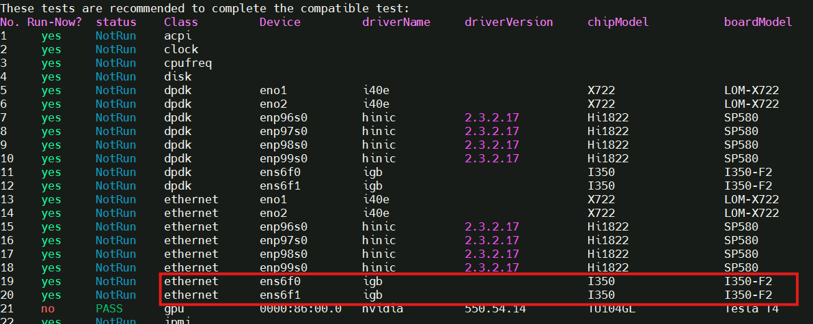

2. 使用`ifconfig xxx`命令配置客户端与服务端网口IP，IP根据自己需要选择。

* 配置客户端。
```
[root@localhost ~]# ifconfig enp4s0f0 2.2.2.3
```
* 配置服务端。
```
[root@localhost ~]# ifconfig ens6f1 2.2.2.4
```
* 配置完成后任意一段ping另一段测试是否连通。
``` 
[root@localhost ~]# ping 2.2.2.4
PING 2.2.2.4 (2.2.2.4) 56(84) bytes of data.
64 bytes from 2.2.2.4: icmp_seq=1 ttl=64 time=0.302ms
64 bytes from 2.2.2.4: icmp_seq=1 ttl=64 time=0.140ms
64 bytes from 2.2.2.4: icmp_seq=1 ttl=64 time=0.124ms
```
3. 服务端准备。
* 使用 `dnf` 安装服务端 oec-hardware-server。

   ```
   dnf install oec-hardware-server
   ```

* 启动服务。本服务通过搭配 nginx 服务提供 web 服务，默认使用 80 端口，可以通过 nginx 服务配置文件修改对外端口，启动前请保证这些端口未被占用。

   ```
   systemctl start oech-server.service
   systemctl start nginx.service
   ```

* 关闭防火墙和 SElinux。

   ```
   systemctl stop firewalld
   iptables -F
   setenforce 0
   ```
4. 客户端测试。

* 编辑`/usr/share/oech/lib/config/test_config.yaml`文件，配置待测网卡端口和服务端IP信息。
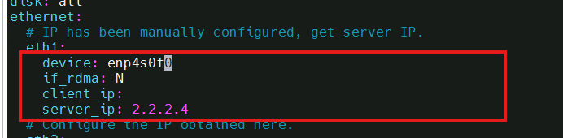

* 配置完成后，选择对应端口的网卡测试项进行测试。


### NVME

确保硬件被工具识别，并且添加到测试项之后，选择对应测试项进行测试。
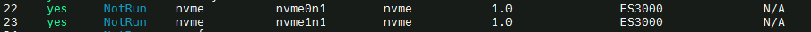


### GPU

1. 从对应GPU厂商官网下载outbox驱动，编译安装到当前环境上。

2. 选择对应测试项进行测试。


### DPDK

1. 进行dpdk测试前，请确保网卡驱动支持dpdk测试（目前支持dpdk测试的驱动：*mlx4_core, mlx5_core, ixgbe, ice, hinic, igc*)。
2. 测试需要额外一台服务器作为服务端，并且需要客户端与服务端安装了相同的待测网卡并确保网卡直连。客户端使用发包模式(Tx-only mode)作为数据包源，服务端使用收包模式(Rx-only mode) 作为数据包接收器, 测试端口传输速率功能。
3. 配置服务端。 为了方便，请在首次启用工具时便设定 `server IP`。[服务端配置参考](https://gitee.com/openeuler/oec-hardware#%E4%BD%BF%E7%94%A8%E6%AD%A5%E9%AA%A4)
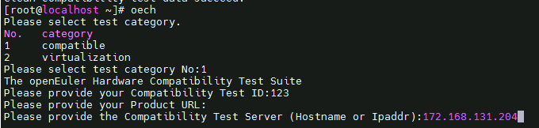 

4. 服务端IP配置正确后，选择对应测试项测试。

### FC

1. FC测试将使用 fio 工具进行FC存储服务器的顺序/随机读写测试，测试之前请先确保FC卡与存储服务器连通并且有传输速率
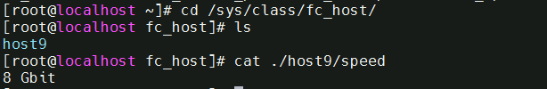

2. 进入存储服务器配置磁盘阵列，配置完成后确保os侧能识别到盘
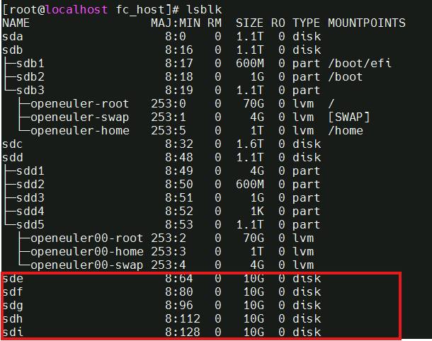

3. 编辑`/usr/share/oech/lib/config/test_config.yaml`文件，更改fc卡pci地址
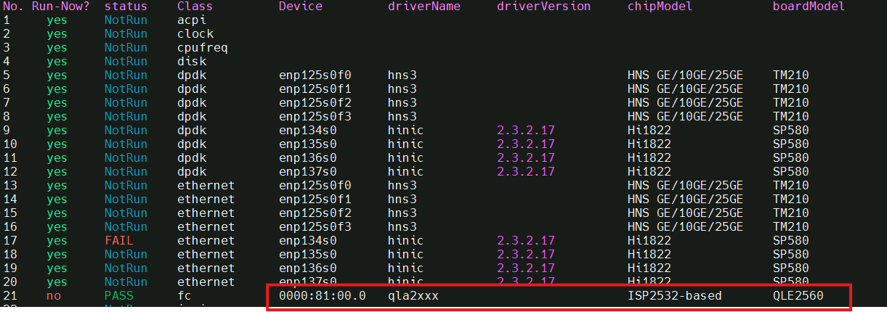
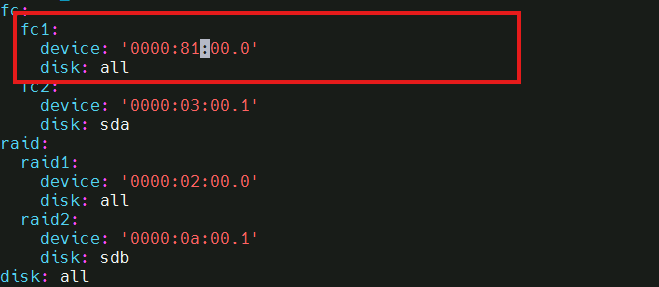

4. 配置完成后，勾选对应fc卡测试项进行测试即可