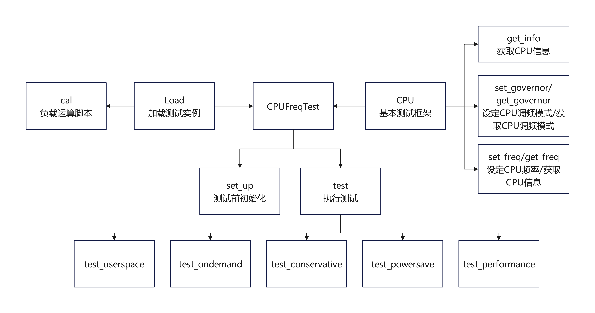
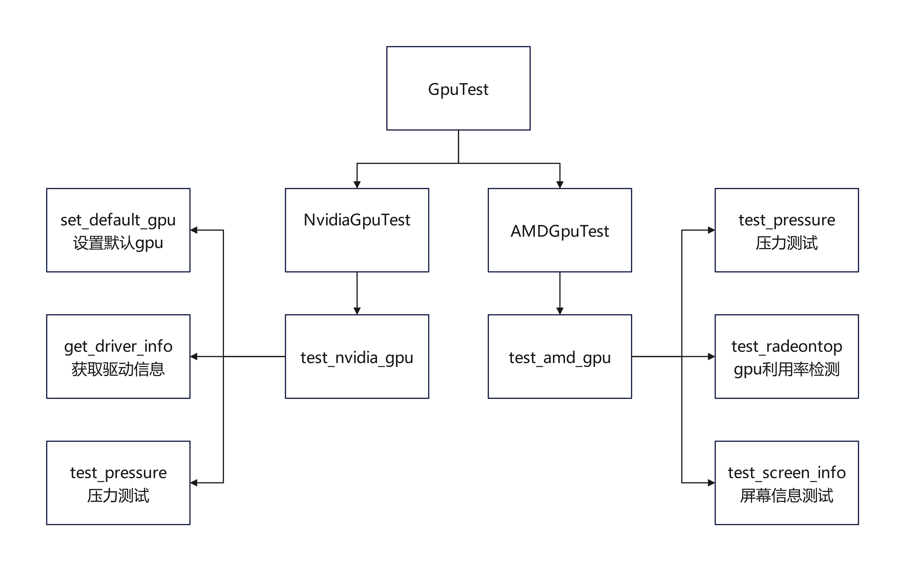
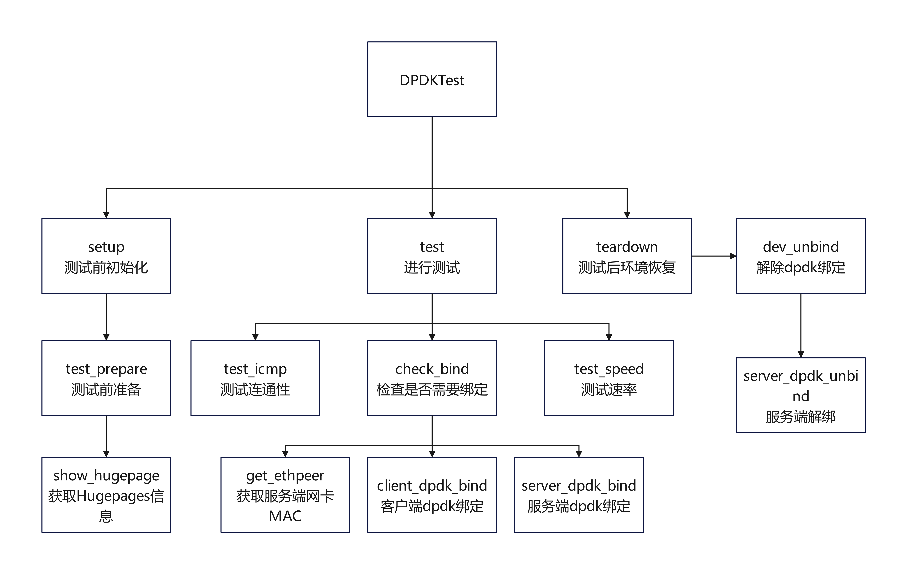

<!-- /TOC -->

* [引言](#引言)
* [测试项详解](#测试项详解)
	* [compatible](#compatible)
        * [1-system](#1-system)
        * [2-cpufreq](#2-cpufreq)
        * [3-clock](#3-clock)
		* [4-memory](#4-memory)
        * [5-network](#5-network)
        * [6-disk](#6-disk)
        * [7-kdump](#7-kdump)
	    * [8-watchdog](#8-watchdog)
        * [9-perf](#9-perf)
        * [10-cdrom](#10-cdrom)
        * [11-ipmi](#11-ipmi)
        * [12-nvme](#12-nvme)
        * [13-usb](#13-usb)
        * [14-acpi](#14-acpi)
        * [15-fc](#15-fc)
        * [16-raid](#16-raid)
	    * [17-keycard](#17-keycard)
        * [18-GPU](#18-GPU)
        * [19-infiniband](#19-infiniband)
        * [20-kabi](#20-kabi)
        * [21-VGPU](#21-VGPU)
	    * [22-spdk](#22-spdk)
        * [23-dpdk](#23-dpdk)
        * [24-srpm](#24-srpm)
        
<!-- /TOC -->

# 引言

本文档将对oec-hardware工具测试项进行详细解读

# 测试项详解

## compatible

### 1-system

#### 检查本工具是否被修改

定义`check_certrpm`方法：通过执行`rpm -V --nomode --nocontexts`命令检查指定的证书包文件完整性。

#### 检查 OS 版本和 kernel 版本是否匹配、内核是否被修改或污染

定义`check_kernel`方法：
1. 根据不同的操作系统获取具体操作系统版本信息。如果是openEuler则调用 hwcompatible.sysinfo 模块获取；如果是 KylinSec 则使用`getoutput("cat /etc/dnf/vars/osversion | sed 's/[^0-9]//g'")`读取内容并进行文本处理；如果是 Kylin 或 UOS 则使用`getoutput("cat /etc/os-release | grep -i version_id | awk -F = '{print $2}' | sed 's/[\"]//g'")`读取内容并进行文本处理。
2. 从`/proc/cmdline`中读取启动参数。
3. 调用 hwcompatible.document 模块，通过 Document 类从预设的环境变量 CertEnv.kernelinfo 中加载内核信息，并与通过 sysinfo.kernel_version 获取的实际内核版本进行比对，检查实际运行的内核版本是否与预期匹配。
4. 读取`/proc/sys/kernel/tained`文件，检查内核是否被标记为污染，如果被污染函数会通过调用`get_modules`方法获取具体模块列表
5. 执行`rpm -V --nomode --nocontexts`命令检查内核rpm包文件完整性
        
#### 检查 selinux 是否正常启用。

定义`check_selinux`方法：通过执行`/usr/sbin/sestatus | grep 'SELinux status' | grep -qw 'enabled'`与`/usr/sbin/sestatus | grep 'Current mode' | grep -qw 'enforcing'`检查selinux是否按照预期启用

#### 使用`dmidecode`命令读取硬件信息。
 
### 2-cpufreq 

#### 测试准备

定义 CPU 类：
1. 定义`get_info`方法，使用`lscpu`命令获取 CPU 信息；访问`/sys/devices/system/cpu/cpu0/cpufreq/scaling_max_freq` 和`/sys/devices/system/cpu/cpu0/cpufreq/scaling_min_freq`获取 CPU 最高频率和最低频率。
2. 定义`set_freq`方法，通过`"cpupower -c %s frequency-set --freq %s" % (cpu, freq)` 设定 CPU 频率；定义`get_freq`方法，通过`"cpupower -c %s frequency-info -w | grep 'frequency' | cut -d ' ' -f 6" % cpu`获取 CPU 频率信息。
3. 定义`set_governor`方法，通过`"cpupower -c %s frequency-set --governor %s" % (cpu, governor)`设定 CPU 调频模式；定义`get_governor`方法，通过`"cpupower -c %s frequency-info -p | grep governor | cut -d '\"' -f 2" % cpu` 获取 CPU 调频模式信息。

定义 Load 类：
1. 定义`run`方法，使用`"taskset -c %s python3 -u %s/compatible/cpufreq/cal.py" % (self.cpu, CertEnv.testdirectoy)`在指定的 CPU 上运行 cal.py 脚本，该脚本设定了高精度数学运算负载来测试 CPU 的性能。
2. 定义`get_runtime`方法，用于获取进程的运行时间。
   
#### 测试 cpu 在不同调频策略下运行频率是否同预期

定义 CPUFreqTest 类：
1. 定义`test_performance test_powersave test_ondemand test_conservative test_userspace`方法，测试在五种调频策略下 CPU 频率变化对性能的影响，其中五种调频策略：
    * performance：始终以最高频率运行，提供最佳性能，但可能消耗更多电力。
	* powersave：尽可能降低频率运行，以节省电力，但可能牺牲性能。
    * ondemand：根据负载动态调整频率，试图在性能和功耗之间找到平衡点。
    * conservative：类似ondemand，但更倾向于低频运行。
    * userspace：允许用户空间应用程序直接控制 CPU 频率。

2. test_userspace 方法：
    * 从可用 CPU 列表中随机选择一个 CPU ，并在最大频率最小频率范围内随机选择一个频率。
    * 使用`set_freq`方法尝试将选定的 CPU 频率设定为新的目标值。
    * 确认所选的 CPU 频率已成功被设置，并且所选的 CPU 调节策略为 userspace 的情况下，分别在最低频率，最高频率下进行负载测试。在两种频率下，为每个 CPU 创建并启动 Load 实例，执行负载并收集运行时间数据。
    * 计算所有 CPU 在最低频率和最高频率下的平均运行时间，并计算加速比（max_average_runtime /min_average_runtime）。
    * 设置一个容差值（tolerance），用于确定加速比的合理范围，并检查所计算的加速比是否落在预期范围。

3. test_ondemand 方法：
    * 先将所有 CPU 的频率调节策略设置为 powersave，接下来将所有 CPU 的频率调节策略设置为 ondemand。
    * 确认 CPU 调节策略为 ondemand 的情况下，创建一个 Load 实例，并在选定的 CPU 上执行负载测试。
    * 负载测试运行期间，获取 CPU 当前频率，检查频率是否已经调整到了最大频率。在负载较高情况下，ondemand 策略应将 CPU 频率提升至最大以提供最佳性能。

4. test_conservative 方法：
    * 先将所有 CPU 的频率调节策略设置为 powersave，接下来将所有 CPU 的频率调节策略设置为 conservative。
    * 确认 CPU 调节策略为 conservative 的情况下，创建一个 Load 实例，并在选定的 CPU 上执行负载测试。
    * 负载测试运行期间，获取 CPU 当前频率，检查频率是否在最大频率与最小频率之间。在负载较高情况下，conservative 策略应将 CPU 频率在最小频率和最大频率之间动态调整，以平衡性能和节能。

5. test_powersave 方法：
    * 将所有 CPU 的频率调节策略设置为 powersave。
    * 确认 CPU 调节策略为 powersave 的情况下，检查选定的 CPU 频率是否等于最低频率。
    * 创建一个 Load 实例，并在选定的 CPU 上执行负载测试。

6. test_performance 方法：
    * 将所有 CPU 的频率调节策略设置为 performance。
    * 确认 CPU 调节策略为 performance 的情况下，检查选定的 CPU 频率是否等于最高频率。
    * 创建一个 Load 实例，并在选定的 CPU 上执行负载测试。

### 3-clock

#### 测试时间矢量性，不会倒回
1. 执行当前目录下的`clock.c`文件。
2. `clock.c`文件中定义`test_clock_direction`函数，通过记录开始时间，让程序 sleep 60s，然后记录停止时间，最后检查停止和开始时间差是否正好为60s，如果时间差不是60s，则时钟方向有误。

#### 测试 RTC 硬件时钟基本稳定性
1. 执行当前目录下的`clock.c`文件。
2. `clock.c`文件中定义`test_rtc_clock`函数，尝试打开`/dev/rtc`设备，读取当前 RTC 时间，并让程序 sleep 120s，然后再次读取 RTC 时间。通过比较两次读取时间差值，减去 sleep 时间，来检查 RTC 是否准确。

### 4-memory

#### 内存读写测试

1. 通过`get_memory`方法获取 memory 信息，检查 self.system_memory 是否存在。
2. 计算用于测试的内存大小(test_mem)，定义为系统空闲内存的百分之90%，默认上限设置为4G。
3. 运行`"memtester %sM 1" % test_mem`命令，使用 memtester 工具进行内存测试。

#### swap 内存压力测试

1. 通过`get_memory`方法获取 memory 信息，检查 self.system_memory 是否存在。
2. 通过 sysctl 命令检查系统配置 vm.panic_on_oom，默认为0的情况下，如果系统内存不足，Linux可能会重启。通过`sysctl -w vm.panic_on_oom=1`设置防止测试工程意外重启。
3. 检查 swap 区大小，如果小于4G，则记录告警信息，建议将 swap 区配置调整到至少10G大小，较小的 swap 区可能不足以应对高强度内存压力测试。
4. 计算测试内存总量(test_mem):extra_men (按free_memory/100 计算, 但不能超过swap的一半或者512MB) 加上 free_memory 内存。
5. 执行当前目录下的`eatmem_test.c`测试脚本，mmap测试内存，触发 swap，进行 120s 读写测试。

#### 测试 hugetlb

1. 更新Huge Pages 配置。输出 Huge Pages 的总数、空闲数和页面大小，根据当前Huge Page 的大小决定需要预留的页面数量。如果页面大小大于或等于512MB，则预留10个页面；如果系统当前没有 Huge Pages，使用 hugeadm 命令创建 Huge Pages 并挂载 Huge TLB 文件系统；如果当前的空闲 Huge Pages 数量少于预留的数量，使用 hugeadm 命令增加 Huge Pages 的数量；如果不需要更新 Huge Pages，设置 update_hugepage 为0。
2. 调用`get_memory`方法来重新获取最新的内存信息，包括 Huge Pages 的状态。如果 `update_hugepage`为1，即 Huge Pages 需要更新。
3. 在空闲 Huge Pages 数据不小于预留数量的一半的情况下，执行当前目录下`hugetlb_test.c`测试脚本进行测试。

#### 内存热插拔测试

1. 定义`hot_plug_verify`方法验证当前运行的Linux内核是否支持内存热插拔功能。
    * 使用`getoutput("uname -r")`获取当前正在运行的内核版本号`kernel`，使用`/boot/config-kernel`构造出内核配置文件完整路径，并检查配置文件是否存在。
    * 在配置文件存在的情况下，使用`self.command.run_cmd`执行`"grep -q -w 'CONFIG_MEMORY_HOTPLUG=y' %s" % config_file`命令来搜索配置文件中是否存在`CONFIG_MEMORY_HOTPLUG=y`这行，这行表示编译时启用了内存热插拔功能。

2. 定义两个方法`online_memory`和`offline_memory`来设置指定路径下内存区域为 `在线/离线` 状态。
    * 设置内存在线/离线。执行命令`"echo 1 | tee %s/online" % memory_path` / `"echo 0 | tee %s/online" % memory_path` 设置内存在线或离线。
    * 执行命令`"grep 'online' %s/state" % memory_path` / `"grep 'offline' %s/state" % memory_path`命令检查state文件中是否包含字符串`online` / `offline` ，以确保内存区域模式被正确设置。

3. 定义`hotplug_memory_test`方法，用于测试内存的热插拔功能。
    * 通过调用 online_memory 方法确保 memory_path 指定的内存模块在线并可用。如果这个操作失败，则直接返回 False。
    * 在内存离线之前，调用 get_memory 方法来获取当前系统的总内存大小，并存储在 total_mem_1 变量中。
    * 尝试通过调用 offline_memory 方法将指定的内存模块设为离线状态。如果这个操作失败，同样返回 False。
    * 再次调用 get_memory 方法获取新的总内存大小，存储在 total_mem_2 变量中。如果 total_mem_2 大于等于 total_mem_1，说明内存并没有成功减少，因此测试失败，返回 False。
    * 将内存重新设置为在线状态，如果失败，将 memory_path 添加到 retry_list 列表中以便后续重试，并返回 False。
    * 最后，再次调用 get_memory 方法获取总内存大小，存储在 total_mem_3 变量中。如果 total_mem_3 不等于 total_mem_1，说明内存并未完全恢复至初始状态，测试失败，返回 False。

4. 定义`memory_hotplug`方法，执行内存热插拔测试。
    * 通过调用 `hot_plug_verify` 方法来确认当前系统内核是否支持内存热插拔。如果系统不支持，测试将被跳过，并返回 True。
    * 搜索 `/sys/devices/system/node/` 目录下的所有子目录，寻找符合 memory[0-9]* 名称模式的内存设备路径。这些路径会被收集到 mem_path_list 列表中。
    * 对于列表中的每一个内存路径，首先检查其是否可移动（即是否支持热插拔）。如果可移动，将开始对该内存进行热插拔测试。
调用 hotplug_memory_test 方法对内存进行测试。如果 self.retry_list 列表中有任何内存路径（在hotplug_memory_test 方法中填充的），那么在测试结束后等待两分钟（120秒），然后尝试重新上线这些内存模块。
    * 最终，方法返回 return_code 的值，表示整个内存热插拔测试的结果。

### 5-network

***网卡测试篇幅较大，本篇仅提供逻辑框架图供参考，详细代码工程请自行查阅***

   * 使用 ethtool 获取网卡信息和 ifconfig 对网卡进行 down/up 测试。
   * 使用 qperf 测试以太网卡tcp/udp延迟和带宽，以及 http 上传、下载速率。
   * 使用 perftest 测试 infiniband(IB) 或 RoCE 网络协议的延迟和带宽。

     **注意** 
   
     进行网络带宽测试时，请提前确认服务端网卡速率不小于客户端，并保证测试网络无其他流量干扰。

### 6-disk

#### 使用 fio 工具进行测试

定义`do_fio`方法，使用fio(Flexible I/O Tester)工具执行一系列的 I/O 测试。
1. 测试参数设置。max_bs 和 a_bs 分别代表最大快和当前快的大小，分别初始化为64KB和4KB。
2. 执行 I/O 测试。循环从 a_bs 到 max_bs，每次循环都将 a_bs 乘以 2。在每次循环中，使用 command.run_cmd 方法执行 `"fio %s -size=%dK -bs=%dK %s" % (file_opt, size, a_bs, option)` 命令，该命令包含了之前确定的文件路径、数据大小、块大小和附加选项。最后检查 fio 命令的返回值（通过 cmd_result[2] 获取），如果返回值不为 0，表示有错误发生。

#### 原始 I/O 性能测试&虚拟文件系统测试

1. 调用`get_disk`方法，获取可用于测试磁盘列表。
2. 调用`valid_disk`方法验证磁盘有效性。
3. 遍历每个盘，调用`raw_test`方法进行原始 I/O 性能测试。检测确认磁盘路径是否存在，然后从`/sys`文件系统中读取磁盘的大小，并根据大小调整测试范围。随后执行一系列的顺序和随机读写测试，包括：
    * 顺序写入
    * 顺序读取
    * 顺序混合读写
    * 随机混合读写
    * 随机读取
    * 随机写入
4. 遍历每个盘，调用`vfs_test`方法进行虚拟文件系统测试。方法首先确认磁盘路径的存在，然后创建一个临时目录用于测试。对于每一个要测试的文件系统，它会格式化磁盘，挂载文件系统，然后执行顺序和随机读写测试。测试完成后，卸载文件系统并删除临时目录。

### 7-kdump

1. 安装必要安装包：使用yum安装与当前内核版本对应的`kernel-debuginfo`包。
2. 检查`crashkernel`参数：从`/proc/cmdline`文件中查找`crashkernel`参数，已确定预留的内核崩溃转储空间大小。
3. 配置Kdump：
    * 加载 Kdump 的配置文件。
    * 设置或更新 vmcore 的保存路径。
	* 确保 Kdump 目标对象设置为 "all"，而非默认的 "kbox"。
    * 重启 Kdump 服务，并检查其状态，确保服务处于活动状态。
4. 触发崩溃：
    * 与用户进行交互，确认准备好重启
    * 如果用户确认，同步文件系统缓冲区，然后通过 /proc/sysrq-trigger 触发系统崩溃。
    * 触发崩溃导致重启，`verify_vmcore`通过self.rebootup传入hwcompatible.reboot，并在重启后被调用。
5. `verify_vmcore`方法：
    * 根据正则表达式匹配vmcore目录，并按时间排序。随后确定最新的vmcore文件路径。
    * 使用`crash`工具读取vmcore文件和vmlinux调试符号，尝试解析vmcore。

### 8-watchdog

1. 初始化：
`_init__` 方法中初始化了一些属性，如优先级 (pri)、是否重启 (reboot)、重启后的回调函数名 (rebootup)、最大超时时间 (max_timeout) 和测试目录路径 (test_dir)。
2. 测试方法：
    * 先加载软狗（softdog）驱动，然后设置和获取 watchdog 的超时时间。
    * 使用`CommandUI`对象提示用户确认是否准备好系统重启，如果用户确认，则系统会同步文件系统缓存并触发 watchdog 导致系统重启。
3. 启动方法：
`startup`方法在重启后执行，使系统重启后恢复 watchdog 的状态。

### 9-perf

1. 初始化定义三个与`perf`相关的命令字符串：
    * perf_record：用于记录性能数据，包括所有的 CPU 周期 (cycles)，并将输出保存到 hwcompatible-perf.data 文件中。
    * perf_evlist：用于列出在 hwcompatible-perf.data 文件中记录的硬件事件。
    * perf_report：用于生成基于 hwcompatible-perf.data 文件的性能报告。
2. 定义`exec_perf`方法执行`perf`工具的三个命令：
    * 运行`perf_record`命令，收集系统在睡眠五秒期间内的CPU周期数据。
    * 运行`perf_evlist`命令，检查`hwcompatible-perf.data`文件中是否存在`cycles`事件。
    * 运行`perf_report`命令，检查性能报告中是否有样本数据。
3. 定义`test`方法调用`exec_perf`进行测试并返回结果。

### 10-cdrom

#### 测试准备

在`set_up`中使用`get_type`获取 CD-ROM 设备的类型；根据设备类型，使用`get_mode`设置测试方法。

#### 重写测试 rw_test

1. 卸载设备：运行`umount`命令卸载设备。
2. 根据设备类型格式化光盘：
    * 如果设备类型包含 "BD"，则使用`dvd+rw-format -format=ful`命令进行全面格式化。
    * 如果设备类型包含 "DVD_PLUS"，则使用`dvd+rw-format -force`命令进行强制格式化。
    * 对于其他类型的可重写光盘，使用`cdrecord -v dev=%s blank=fast`进行快速擦除。
3. 重新加载光盘：在格式化或擦除后，调用 `self.reload_disc(devname)`方法来重新加载光盘。这一步可能涉及到弹出和重新插入光盘的动作，以确保设备正确识别已经格式化的光盘。
4. 执行写入测试：调用`self.write_test()`执行写入测试。

#### 写入测试 write_test

1. 卸载设备：运行`umount`命令卸载设备。
2. 蓝光和 DVD+RW 写入：
    * 如果设备类型包含 "BD" 或 "DVD_PLUS"，则使用 growisofs 命令将目录树（位于 self.test_dir）写入光盘。growisofs 通常用于写入蓝光和DVD+RW光盘。
    * growisofs 命令执行后，调用 self.reload_disc 方法重新加载光盘，确保写入操作成功。
1. CD/DVD 写入选项确定：如果不是蓝光或DVD+RW，代码会检查光驱支持的写入模式（TAO 或 SAO）和特性（如 Burn-free），并相应地设置写入选项 write_opts。
2. 创建ISO映像并写入光盘：
    * 使用`mkisofs`命令从`self.test_dir`创建一个 ISO 映像文件`test_cdrom.iso`。
    * 然后使用`cdrecord`命令将 ISO 映像写入光盘，同时应用前面确定的写入选项。
    * 写入完成后，再次调用`self.reload_disc`方法重新加载光盘，以验证写入操作。
#### 读取测试 read_test

1. 准备挂载点：
    * 如果先前用于挂载光盘的目录（self.mnt_dir）存在，先删除它。
	* 创建一个新的目录 self.mnt_dir 作为光盘的挂载点。
2. 挂载光盘：
    * 使用 mount 命令以只读模式 (-o ro) 将光盘（devname）挂载到 self.mnt_dir。
3. 检查光盘是否为空：
    * 使用 df 命令获取已使用的磁盘空间信息，通过 awk 提取第三列（已使用空间大小）。
    * 如果光盘为空，记录错误信息并卸载光盘，然后删除挂载点目录，最后返回 False 表示测试失败。
4. 复制文件到另一目录：
    * 如果用于存放复制文件的目录`self.device_dir`存在，先删除它。
    * 创建一个新的目录`self.device_dir`。
    * 使用 cp 命令深度复制光盘上所有文件到`self.device_dir`。
5. 比较文件一致性：
    * 调用`self.cmp_tree()`方法比较`self.mnt_dir`和`self.device_dir`中的文件内容。
    * `self.cmp_tree()`方法返回一个布尔值，指示两个目录中的文件是否完全相同。
6. 清理和返回结果：
    * 卸载光盘。
    * 根据`self.cmp_tree()`的返回值来决定测试结果，如果文件比较成功，则记录成功信息并返回 True；如果文件比较失败，则记录错误信息并返回 False。

### 11-ipmi

1. 定义`start_ipmi`方法，执行`systemctl start ipmi`启动 IPMI 服务，并检查服务的状态。
2. 定义`ipmitool`方法，执行`ipmitool fru`和`ipmitool sensor`命令使用 ipmitool 工具执行测试。

### 12-nvme

1. 初始化测试环境
2. 获取设备信息
    * 调用`get_name`从`self.device`获取设备名称。
    * 调用`in_use`方法检查设备是否在使用中。
3. 计算测试大小
    * 计算设备总大小。
    * 如果小于等于0或大于128MB，则调整测试大小。
4. 获取设备扇区大小
    * 获取NVMe设备列表的JSON格式信息。
    * 查找测试设备的扇区大小。
5. 执行`cmd_list`中的命令，进行测试
    * 创建一个大小为 150000 字节的文件。
    * 格式化 NVMe 设备。
    * 向设备写入数据。从设备读取数据。
    * 获取设备的 SMART 日志。获取设备的日志。
6. 执行额外 fio 测试
    * 调用`raw_test`方法执行额外的测试。
7. 记录测试结果

### 13-usb

1. 定义初始化
    * 设置`self.requirements`为一个列表，包含USB测试所需的软件包`usbutils`
2. 使用 lsusb -t 命令显示当前连接的所有USB设备。
3. 调用`get_usb`方法获取初始的USB设备列表 plugged_device。
4. 进入一个无限循环，等待用户插拔USB设备，并验证设备的变化。
    * 请求用户插入一个USB设备，并等待确认。
    * 检测是否有新设备插入。
    * 如果有新设备插入，获取新设备的信息，并更新 plugged_device。
    * 请求用户拔出刚刚插入的USB设备，并等待确认。
    * 检测是否有设备被拔出。
    * 如果设备被成功拔出，更新 plugged_device。
    * 如果所有USB插槽都被测试过，测试结束并返回 True。

### 14-acpi

工具会打开目录 `sys/fireware/acpi/tables` 下的acpi表，利用 acpidump 工具读取数据。
    
    
### 15-fc

1. 测试前进行初始化以及设置
    * 进行变量定义。
    * 从`args`参数中获取必要信息，如日志记录器、命令执行对象、配置数据等。
    * 获取设备的PCI编号 pci_num。
    * 显示驱动信息和PCI设备的详细信息。
    * 调用`query_disk`方法来查询磁盘信息。
2. 进行测试
    * 调用`check_link_state`方法检查HBA卡的链接状态。
    * 如果链接状态正常，继续获取磁盘列表并开始测试。
    * 对于每个磁盘，调用`raw_test`和`vfs_test`执行测试。
    * 返回最终的测试结果。

### 16-raid

1. 测试前进行初始化以及设置
    * 进行变量定义。
    * 从`args`参数中获取必要信息，如日志记录器、命令执行对象、配置数据等。
    * 获取设备的PCI编号 pci_num。
    * 显示驱动信息和PCI设备的详细信息。
    * 调用`query_disk`方法来查询磁盘信息。
2. 进行测试
    * 调用`get_disk`函数来获取磁盘列表。如果没有找到适合测试的磁盘，则记录错误信息并返回 False。
    * 从`config_data`中获取待测试的磁盘名称。
    * 检查磁盘的有效性。
    * 如果指定测试所有的磁盘，则将`self.disks`设置为所有磁盘的列表。
    * 对于每个磁盘，调用`raw_test`和`vfs_test`执行测试。

### 17-keycard

测试加密卡是否能正常使用。

### 18-GPU

#### NVIDIA GPU

1. 构造函数 (__init__)：
    * 初始化成员变量，包括 device（待测试的GPU设备）、logger（日志记录器）、command（命令执行器）以及与测试相关的日志文件路径。
    * 设置 smi_name 成员变量，默认为 "nvidia-smi"，用于与 NVIDIA SMI 工具交互。
2. get_driver_info() 方法：
    * 获取GPU的驱动信息，包括驱动名称和版本。
    * 使用 lspci 命令显示PCI设备的详细信息。
    * 根据设备的驱动名称调整 smi_name，如果是 iluvatar-itr 驱动，则使用 ixsmi。
    * 记录驱动名称和版本信息。
3. set_default_gpu() 方法：
    * 设置默认的GPU，以便后续测试。
    * 从 nvidia-smi 输出中获取所有GPU的信息。
    * 查找与当前测试设备匹配的GPU，并将其设置为默认的GPU。
4. test_pressure() 方法：
    * 执行GPU的压力测试。
    * 使用 nvidia-smi 监控GPU温度和利用率。
    * 安装并运行 gpu_burn 工具来进行压力测试。
    * 持续监控直到测试完成或超时。
5. test_nvidia_gpu() 方法：
    * NVIDIA GPU测试的入口函数。
    * 调用 get_driver_info() 获取驱动信息。
    * 执行一系列GPU测试，包括压力测试、clpeak测试、CUDA样例测试、nvidia-smi测试以及Vulkan测试。
    * 返回最终的测试结果。

#### AMD GPU

1. 构造函数 (__init__)：
    * 初始化成员变量，包括 device（待测试的GPU设备）、logger（日志记录器）、command（命令执行器）以及与测试相关的日志文件路径。
2. get_driver_info() 方法：
    * 获取GPU的驱动信息，包括驱动名称和版本。
    * 使用 lspci 命令显示PCI设备的详细信息。
    * 记录驱动名称和版本信息。
3. test_pressure() 方法：
    * 执行GPU的压力测试。
    * 使用 glmark2 工具来进行压力测试。
    * 检查 glmark2 的得分以验证测试的成功与否。
4. test_screen_info() 方法：
    * 测试GPU的屏幕信息。
    * 使用 glmark2 工具来获取屏幕信息。
    * 检查命令执行的结果。
5. test_radeontop() 方法：
    * 使用 radeontop 工具检查GPU的利用率。
    * 通过分析输出来验证测试的成功与否。
6. test_amd_gpu() 方法：
    * AMD GPU测试的入口函数。
    * 调用 get_driver_info() 获取驱动信息。
    * 安装必要的工具，如 radeontop 和 glmark2。
    * 执行一系列GPU测试，包括 radeontop 测试、屏幕信息测试以及压力测试。
    * 返回最终的测试结果。
    
         
         **注意** 
      
         AMD GPU测试依赖图形界面，在测试前需要部署并切换到图形界面。

### 19-infiniband

继承`network`测试中父类`RDMATest`，引用多个测试方法，包括`test_ip_info/test_ibstatus/test_ib_link/test_icmp/test_rdma`。
    
      **注意** 
      
      IB测试需要确保网卡模式切换到IB模式
      进行网络带宽测试时，请提前确认服务端网卡速率不小于客户端，并保证测试网络无其他流量干扰。

### 20-kabi

1. 取系统架构，如果不是aarch64或x86_64,退出测试。
2. 如果/var/oech目录下面没有symvers开头的内核版本的符号版本信息文件，从/boot目录拷贝这个文件到该目录下，并进行解压。
3. 检测/root/rpmbuild/SOURCES/目录下是否有服务器架构对应的Module.kabi_xxx文件，如果没有，从source源中下载内核版本的源码文件，并进行安装，会生成kaib文件；否则这步跳过。
4. 从kabi文件中获取函数信息，在符号版本信息文件中查找该函数名称，如果可以找到，并且CRC值相同，校验通过；如果找到，但是crc值不同，将kabi函数信息和符号版本中变更的CRC值保存到kabi-changed.log文件中；如果没有找到，将kabi函数信息保存到kabi-missing.log文件中，这两个文件会打包到测试日志中。

### 21-VGPU
***测试前在服务端安装cuda***
1. 在服务端通过执行nvidia-smi命令，检测nvida驱动是否安装成功。
2. 调用test_vgpu.sh文件的create_vm函数创建虚拟机。
3. 将驱动从宿主机上拷贝到虚拟机上(提前将vgpu驱动放到宿主机的root目录下)，通过sshcmd函数实现远程安装依赖、查询nvidia设备，安装vgpu驱动。
4. 使用nvidia-installer --sanity --ui=none命令，在没有任何用户界面的情况下检查虚拟机的健壮性。
5. 使用nvidia-smi命令检测虚拟机上驱动的版本。
6. 通过test_vgpu.sh文件的destory_vm方法，销毁虚拟机。
	
### 22-spdk

1. 加载uio_pci_generic驱动。
2. 获取空闲内存、NUMA node个数、大页内存大小，来计算配置多少个大页。
3. 使用空闲内存的一半空间来配置大页内存。
4. 使用spdk_nvme_perf工具对nvme卡进行读、写、随机读、随机写、读写、随机读写操作。
5. 卸载uio_pci_generic驱动。

### 23-dpdk

#### 测试准备
1. 通过`set_up`方法，在测试前进行初始化，包括设置日志记录器、命令执行器、Hugepages 显示器等组件，获取设备属性信息，执行 DPDK Hugepages 的卸载、清理和设置操作，以及从配置文件中获取服务器 IP。
2. 通过`show_hugepage`方法，调用`hugepages`模块，获取系统上 Hugepages 信息。
3. 通过`test_prepare`方法，调用`hugepages`模块，检查 Hugepages 是否已经正确分配和挂载。

#### dpdk测试

1. 调用`test_icmp`方法检测客户端和服务端的连通性。
2. 调用`check_bind`方法
    * 检测网卡驱动是否在支持的列表中，如果在继续往下测试，否则停止测试。
    * 使用modprobe uio; modprobe 驱动命令，加载dpdk驱动。
    * 调用`get_ethpeer`方法获取服务端网卡的mac地址。
    * 调用`client_dpdk_bind`和`server_dpdk_bind`方法，通过`dpdk-devbind -b`命令将客户端和服务端的端口和dpdk驱动绑定，如果是mellanox网卡则不需要进行绑定。
3. 客户端调用`call_remote_server`方法，使得服务端通过`dpdk-testpmd`命令启动并开始转发数据包。
4. 客户端调用`test_speed`方法，通过`dpdk-testpmd`命令接收数据包，并计算出测试速率。
5. 客户端调用`call_remote_server`方法，使得服务端通过`dpdk-testpmd`命令停止转发数据包。
6. 调用`dev_unbind`方法，客户端和服务端解除网卡和dpdk驱动的绑定。

### 24-srpm

***测试当前os版本的源码包srpm是否符合该版本最小集核心包选型基线要求（支持24.03-LTS以后版本）***
1. 查询系统内核版本。
2. get_min_srpms方法获取最小集核心包的包名和版本，保存到base_rpms参数中。
3. query_repo_rpms方法获取source和epol源中所有包的包名和版本，保存到src_rpms参数中。
4. dumps_srpm方法取最小集核心包中每个包的包名和版本，和源码中的包进行比较。在源码包中没有找到的包或找到包但是版本不相同，以CSV格式保存到日志中，并认为测试失败，否则测试成功。
